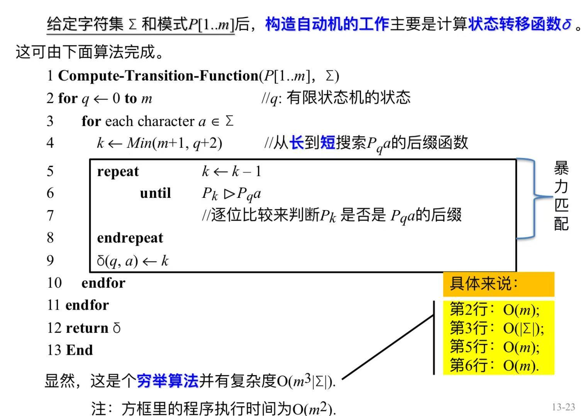
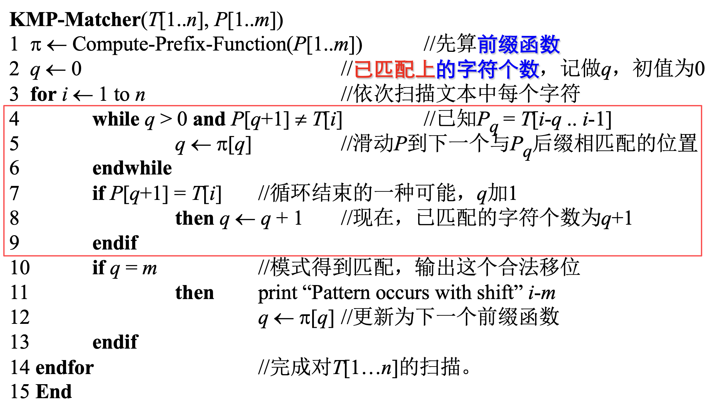
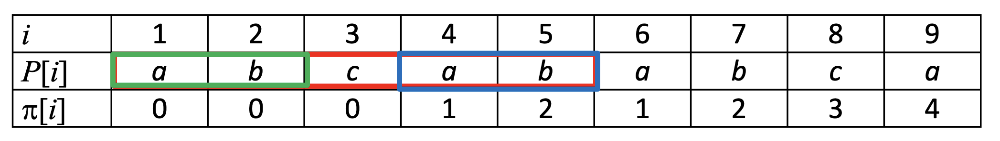
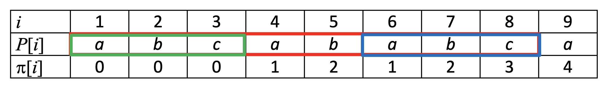
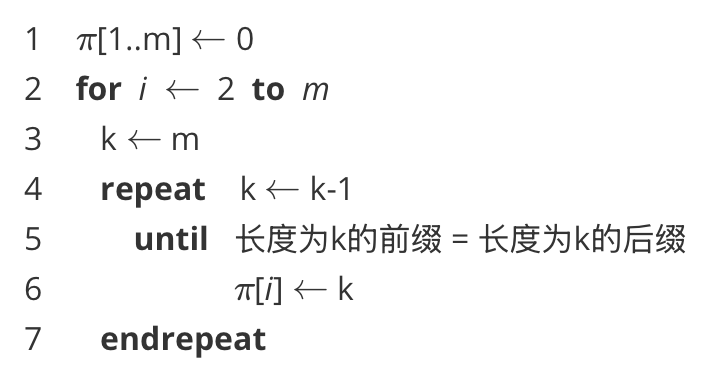
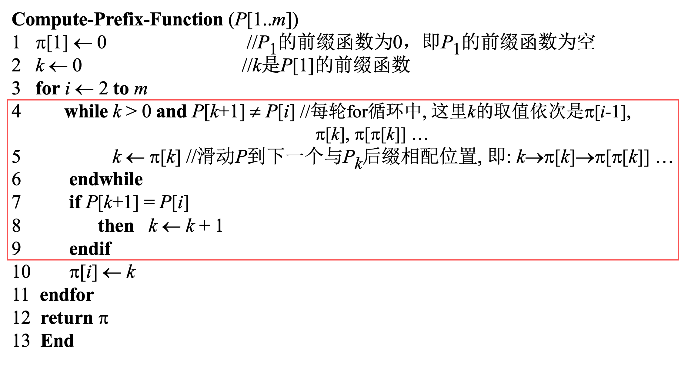

# KMP

- 有限状态机的构造，复杂度较高

    

    
回顾下这里代码第3行，需要遍历所有的字符a

    

    

# 一、 伪代码

> 可以看到**KMP**算法，与**有限状态机**的匹配过程很像  
> 代码的`4-9`行，就是**有限状态机**中，寻找下一个状态的过程

**有限状态机**需要提前计算好状态转移函数，  
而**KMP**中，则是通过一个**前缀函数**来在线计算，每次应该转换到哪个状态

# 二、 前缀函数

## 2.1 示例

例如一个字符串`abcababca`，我们来看看前缀函数怎么计算的

1. i=4

> `abca`中，长度为1的前缀，与长度为1的后缀，相同  
> 且找不到长度为2、3的前缀，满足这种关系了

2. i=5

> `abcab`中，长度为2的前缀，与长度为2的后缀，相同  
> 且找不到长度为3、4的前缀，满足这种关系了

3. i=8

> `abcababc`中，长度为3的前缀，与长度为3的后缀，相同  
> 且找不到长度为4、5、6、7的前缀，满足这种关系了

> 有了这几个示例，前面i=1,2,3的时候，也好理解了：  
> 找不到满足条件的前缀，即存在长度为0的前缀，与长度为0的后缀，相同  
> 所以$\pi(1) = \pi(2) = \pi(3) = 0$

## 2.2 伪代码

我只能想到这样写

> 复杂度$O(m^3)$

**KMP**算法则是这样写的：

> 复杂度$O(m)$
