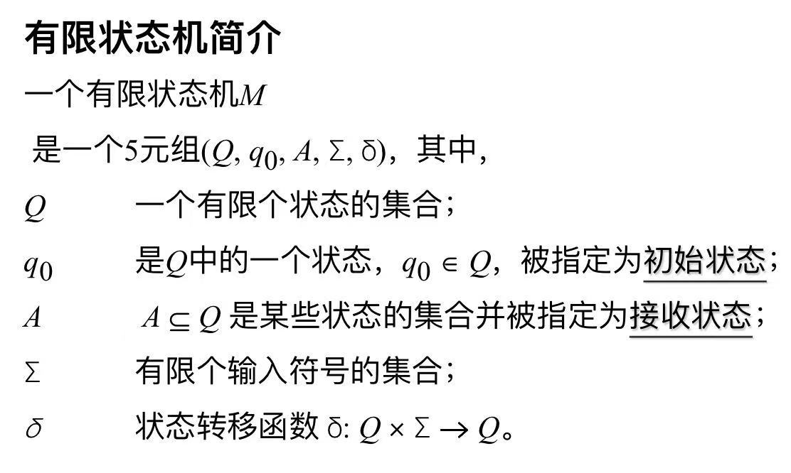
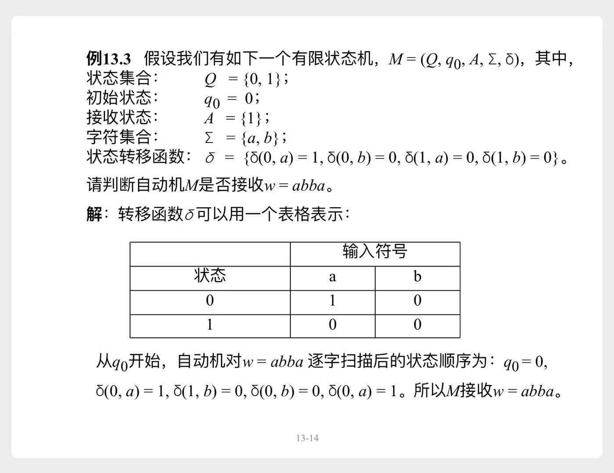
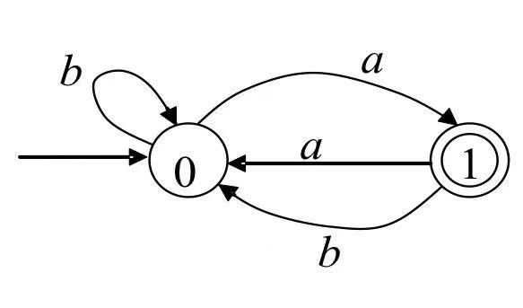
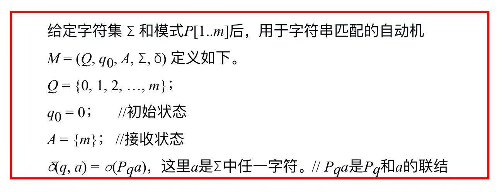
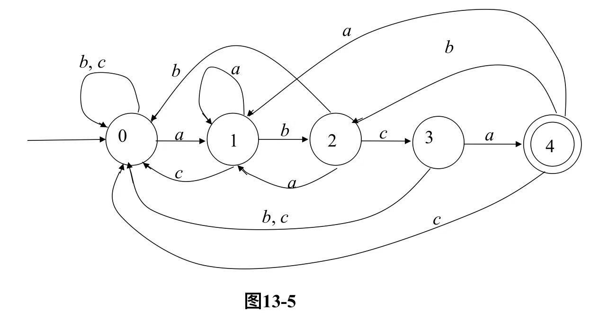

# 有限状态机（finite state automata, FSA）

# 一、基本概念

一个具体示例

> 可以等价地表示为一个有向图：  
> 

---

# 二、字符串匹配中的有限状态机

## 2.1 定义

> Q中有`m+1`个状态
> 1. 状态`0`，表示目前匹配了0个字符
>    - 初始状态 $q_0 = 0$
> 2. 状态`1`，表示目前匹配了1个字符
> 3. ...
> 4. 状态`m`，表示目前匹配了m个字符
>    - 接收状态，表示匹配成功

## 2.2 示例

假设有 字符集 $\sum = \{a, b, c\}$，模式P = `abca`  
构造出的有限状态机如下：

## 2.3 伪代码

具体怎么构造呢？伪代码如下：

## 2.4 字符串匹配

构造好**有限状态机**，匹配过程就很简单了

