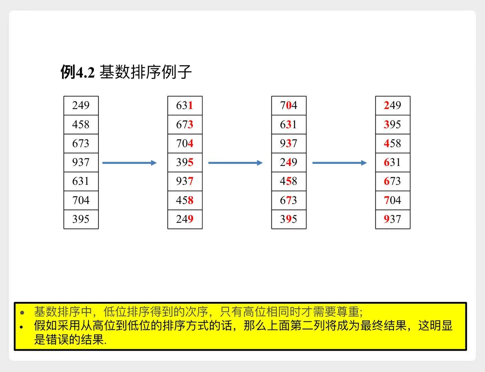

# 基数排序

# 一、基本思想

从低位到高位，逐位排序

- 图解：
    

# 二、正确性

**证明**：若**a**<**b**，那么排序后，**a**一定在**b**前面

1. 假设**a**的d位数字为$[a_d, a_{d-1}, ..., a_{h+1}, a_h, ..., a_2, a_1]$  
假设**b**的d位数字为$[b_d, b_{d-1}, ..., b_{h+1}, b_h, ..., b_2, b_1]$

2. 不妨设
$$
\begin{aligned}
a_d &= b_d \\
a_{d-1} &= b_{d-1} \\
... \\
a_{h+1} &= b_{h+1} \\
a_h &< b_h
\end{aligned}
$$

3. `基数排序`时，从低位到高位进行。对h位排序后，由于 $a_h < b_h$，**a**排在**b**前面
4. 由于`计数排序`是稳定的，之后对高位的排序不会改变**a、b**之间的顺序
- 所以最终**a**一定在**b**前面