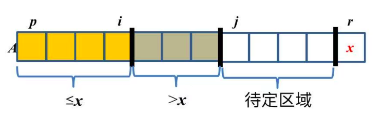
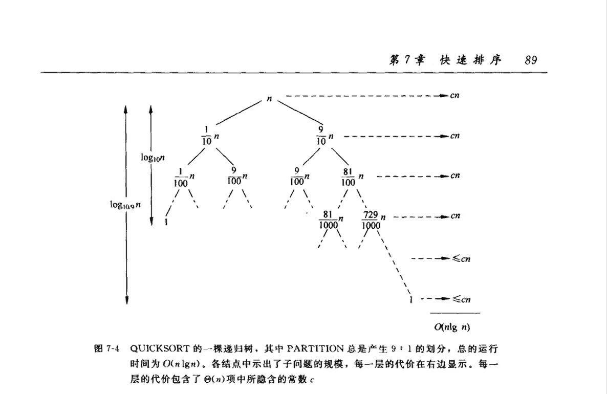

# 快速排序

# 一、将数组划分为两部分

**快速排序**，主要依赖于这步拆分操作

## 1.1 Lomuto分区方案
- 一些变量的定义:
    
    > 结合这张图，好好熟悉下拆分操作的流程

## ~~1.2 Hoare分区方案~~

# 二、快速排序

## 2.1 底&分&合

**分**：选取数组中的一个数作为`主元元素`，将数组切分为两部分  
**底**：拆封到数组只剩一个元素时，直接返回  
**合**：不需要额外操作

## 2.2 复杂度分析

### 2.2.1 最差情况

1. 先观察这种情况：待排序数组已经有序，即`A[1]≤A[2]≤...≤A[n]`（或者递减）
    - 我们可以计算一下它的比较次数：$(n-1) + (n-2) + ... + 1 = \frac {n(n-1)} 2 $
2. 那么有没有比这个更差的情况呢？
    - 这个定理告诉我们没有了：

        

        
<b>定理</b>

        
        给定序列A[p...r]，快速排序最多需要 $\frac {n(n-1)} 2$ 次比较 （~~证明略~~）

        

- 所以`A[1]≤A[2]≤...≤A[n]`就是最差情况，复杂度为 $O(n^2)$

### 2.2.2 最好情况

最理想的情况，每次都划分成两个相同大小的数组。  
不妨设 $n = 2^{k+1} - 1 \Rightarrow \frac {n-1} 2 = \frac {2^{k+1} -2} 2 = 2^k -1$，$\frac {n-1} 2$恰好为整数

于是：
$$
T(n) = 2T(\frac {n-1} 2) + (n-1) \approx 2T(\frac n 2) + (n-1) = \Theta(n \lg n)
$$

> 上面是假设每次都划分成两个相同大小的数组。其实每次都按`9:1`划分，或者按`99:1`，也有类似的结论。  
> 

> 
证明过程

> 
> 
> 
> - 每次都按`9:1`划分，递推关系为：$T(n) \approx T(\frac 1 {10} n) + T(\frac 9 {10} n) + n$
> 1. 递归树拆分到第二层，对应 $T(n) = T(\frac 1 {10} n) + T(\frac 9 {10} n) + n$
> 2. 递归树拆分到第三层，对应 $T(n) = T(\frac 1 {100} n) + T(\frac 9 {100} n) + T(\frac 9 {100} n) + T(\frac {81} {100} n) + \left[\frac 1 {10} n + \frac 9 {10} n + n\right]$
> 3. ...
> 4. 直到最后拆分完，整体复杂度为**所有结点之和**
> - 观察一下这棵树
>   1. 每层的结点之和$\le cn$
>   2. 最多有 $\log_{\frac {10} 9} n$ 层（树的最大深度）
> - 即可得出结论，复杂度 $\le cn \log_{\frac {10} 9} n = O(n \lg n)$
> 

课上还有同学问：如果第一次是按`9:1`划分，第二次是`30:1`，...，结论还成立吗？（毕竟这样才更符合实际）  
> 这种情况下，我们总可以找到划分最不平衡的那次比例，例如为`70:1`  
> 即使每次都按`70:1`去划分，我们都能有类似的结论  
> 那么对于提出的这种情况，肯定要比每次都按`70:1`去划分，复杂度低一些的。所以也是成立的

### 2.2.3 平均情况

将 $\{a_1, a_2, ..., a_n\}$ 排序后的结果记为 $\{z_1, z_2, ..., z_n\}$，即$z_1 \le z_2 \le ... \le z_n$

1. 由于排序过程中，$z_i与z_j$最多比较一次，我们可以引入一个随机变量$X_{ij}$，使得：
$$
\begin{cases}
X_{ij} = 1, z_i与z_j曾做过比较 \\
X_{ij} = 0, 未做过比较
\end{cases}
$$

2. 那么整个排序过程中，总的比较次数就可以这样来计算：$\sum\limits_{i=1}^{n-1} \sum\limits_{j=i+1}^n X_{ij}$

3. 我们要求平均比较次数的话，就可以这个式子：
$$
\begin{aligned}
EX &= E\left[ \sum\limits_{i=1}^{n-1} \sum\limits_{j=i+1}^n X_{ij} \right] \\
&= \sum\limits_{i=1}^{n-1} \sum\limits_{j=i+1}^n E[X_{ij}] \\
&= \sum\limits_{i=1}^{n-1} \sum\limits_{j=i+1}^n [z_i与z_j做比较的概率]
\end{aligned}
$$

4. 参考课件，理解一下`z_i与z_j做比较的概率`，这里直接给出结论：$p=\frac 2 {j-i+1}$

5. 于是就可以继续求解：
$$
\begin{aligned}
EX &= \sum\limits_{i=1}^{n-1} \sum\limits_{j=i+1}^n [z_i与z_j做比较的概率] \\
&= \sum\limits_{i=1}^{n-1} \sum\limits_{j=i+1}^n \frac 2 {j-i+1} \\
&= \sum\limits_{i=1}^{n-1} \sum\limits_{k=1}^{n-i} \frac 2 {k+1} & 令k=j-i \\
&< \sum\limits_{i=1}^{n-1} \sum\limits_{k=1}^{n} \frac 2 k \\
&= \sum\limits_{i=1}^{n-1} O(\lg n) & 第一章的背景知识：调和数的上界 \\
&= O(n \lg n)
\end{aligned}
$$