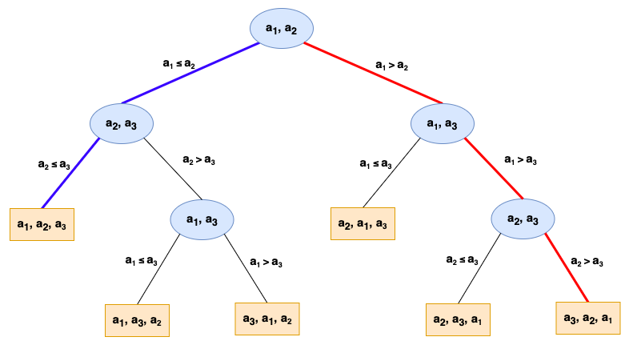

# 比较排序算法的问题复杂度

# 一、从决策树角度来理解排序问题
假设我们要对数组 $\{ a_1, a_2, a_3 \}$ 排序，可以用这张图来整理出所有可能的情况：

1. 每个内部结点，代表进行一次比较
2. 每个叶子结点，代表一种排序结果。
    - 该叶子结点的深度，也就是得到这种结果时，需要进行的比较次数
    - 根据数学知识，我们知道对于n个数，共有n!种不同的排列。于是这棵树也就有n!个叶结点
3. **树的高度，就等于最坏情况下，所需的比较次数**

> 再加深一下理解：  
> 对于**插入排序**，最好情况，对应图中的蓝色路径  
> 最差情况，对应图中的红色路径

# 二、比较排序的下界

## 2.1 最坏情况

有了前面的理论基础，这个问题就很简单了

> 比较排序对应的决策树，一定是二叉树，且有n!个叶子  
> 高度为h的二叉树，最多有$2^h$个叶子

- 于是：
$$
2^h \ge n! \Longrightarrow h \ge \lg (n!)
$$

看看第一节里的结论：**树的高度，就等于最坏情况下，所需的比较次数**

就可以得出结论，任何一个排序算法，至少需要 $\lceil \lg (n!) \rceil$ 次比较

## 2.2 平均情况

**引理**：有l个叶结点的二叉树，外路径总长 $EPL(T) > l(\lceil \lg l \rceil - 1)$

> 叶子结点的深度，也就是得到这种结果时，需要进行的比较次数  
> 所以决策树T的外路径总长，代表得到每一种排序结果，总共需要进行的比较次数  
> 叶子结点数，则对应着共有多少种排序结果

- 于是一个排序算法，平均需要进行的比较次数为：$\frac {T的外路径总长} {叶子结点数}$

$$
平均比较次数 = \frac {EPL(T)} {l} > \frac {l(\lceil \lg l \rceil - 1)} {l} = \lceil \lg l \rceil - 1 = \lceil \lg n! \rceil - 1
$$

## 2.3 最好情况

似乎没什么可讲的：叶子结点的最小深度
> 参考最上面那张图中的**蓝色路径**（插入排序的最好情况）  
- 想要将`n`个数字排序，至少需要比较`n-1`次

# 三、堆排序的最好情况下界
- 于是单拎出**堆排序**，来找它的最好情况下界

**引理**：有n个结点的二叉树，全路径总长 $TPL(T)>n(\lfloor \lg n \rfloor - 2)$

1. 假设n=2k，为偶数。那么在一个建好的**最大堆**中，一定有k个内结点，k个叶子结点
    - 回顾下[堆排序](计算机算法设计与分析/排序算法/堆排序.md)这一节，最开始的示意图，就想明白了
2. 先用反证法证明了：k个叶子结点中，至少有 $\lfloor \frac k 3 \rfloor$ 个叶子 `≤x`
    - 那么叶子结点最多能放下 $k - \lfloor \frac k 3 \rfloor$个`>x的数`，剩下 $\lfloor \frac k 3 \rfloor$ 个 `>x的数`只能放在内结点了
    - 也就是说，至少有 $\lfloor \frac k 3 \rfloor = \lfloor \frac n 6 \rfloor$ 个内结点 `>x`
3. 堆排序中，经过k次循环，输出前k个数，所有`>x的数`都被输出
    - 这$\lfloor \frac n 6 \rfloor$ 个`>x的数`一定会被输出
4. 每个内结点a被输出，至少需要 2 * depth(a) 次比较
    - 内结点只能一步一步往上爬
    - 叶子结点就不一定了，可能直接就会被置顶..
    - 这$\lfloor \frac n 6 \rfloor$ 个内结点被输出，至少需要比较 $2 * \sum depth(a)$ 次
5. 接下来关注$\sum depth(a)$就可以了
    - 这$\lfloor \frac n 6 \rfloor$ 个内结点在刚建好的堆中，可能并不“紧凑”
    - 将这些结点一步步往上挪（其余结点删掉），最后得到一个只有$\lfloor \frac n 6 \rfloor$ 个结点的二叉树
    - 这个操作只会让$\sum depth(a)$ 不变或减小
6. 那么最后这棵二叉树的$\sum depth(a)$，也就是这棵树的全路径总长 $TPL(T)$，由**引理**我们知道：
$$ TPL(T)>\lfloor \frac n 6 \rfloor (\left\lfloor \lg \lfloor \frac n 6 \rfloor \right\rfloor - 2) $$
- 至此就可以得出结论，堆排序在前$k(= \frac n 2)$次循环中，至少需要比较：
$$ 2 TPL(T) = \Omega (n \lg n) $$
- 所以整个堆排序，至少也需要比较这么多次