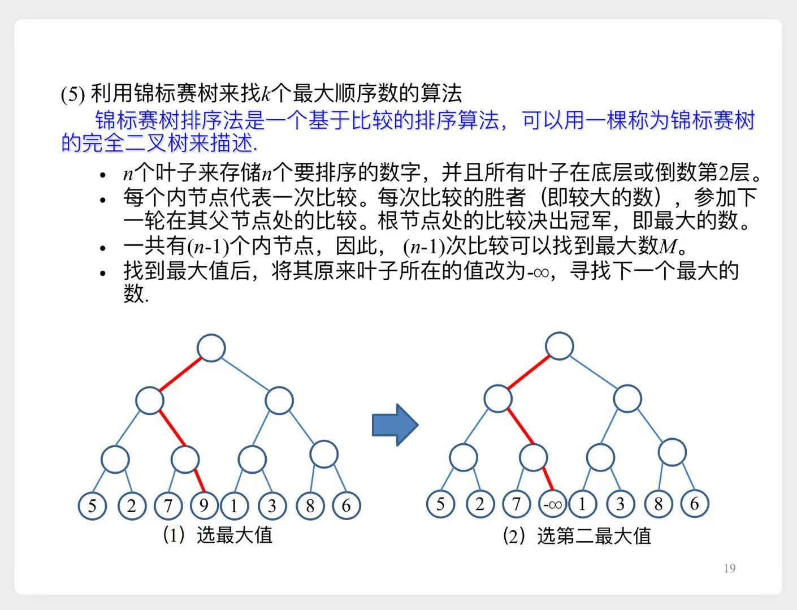

# top k

# 一、实际应用

1. 找出访问次数最多的前100个网站
2. 找出访问次数最多的前1000个视频
3. ...

# 二、各种算法比较

- 例如从 $10^9 \approx 2^{30}$ 个数字中，找出前 $1000 \approx 2^{10}$个

1. 重复1000次，每次找最大的数。大约需要`1000n`次
2. 回顾上一章，找出第1000顺序数。大约需要`60n`次（常数因子为60）。然后再遍历一遍，取出top1000
3. 归并排序，需要 $n \lg n \approx$ `30n`次（常数因子为1）。排好序后取出top1000
    - 归并排序需要 $\Omega(n)$ 的额外存储开销
4. 利用**最小堆**
    1. 先取出k个数建**最小堆**
    2. 遍历剩下的数，与堆顶元素比较
        1. 小于等于堆顶，丢弃
        2. 大于堆顶，取代堆顶元素，然后修复堆
    3. 最后堆中的k个数，即为topk
    - 每次修复堆，大约需要 $2 \lg k$ 次比较，所以共需要 $2n \lg k \approx$ `20n`次
5. 利用**最大堆**
    1. 用这n个数建**最大堆**，大约需要`2n`次比较

        

        
详细推导过程

        
        - 直观理解（最坏情况下）
            1. 约n/2个结点（叶子）高度为0，需要调整0次。
            2. 约n/4个结点高度为1，需要调整1次，进行2次比较
            3. ...
            4. 1个结点（根）高度为 $\lg n$，需要调整 $\lg n$ 次，进行 $2 \lg n$ 次比较
            - 加权求和后，结果为`2n`
        - 公式推导
            1. 一个高度为H的完全二叉树，大约有 $n=2^{H+1}-1$ 个结点
            2. 高度为h的层，有 $2^{H-h}$ 个结点，每个结点需要进行2h次比较
            3. 总比较次数为：
            $$
            \begin{aligned}
            T(n) &= \sum\limits_{h=0}^H 2^{H-h} 2h & 按层求和 \\
            &= \sum\limits_{h=0}^H \frac {2^H} {2^h} 2h \\
            &= \sum\limits_{h=0}^H \frac {2^{H+1}} {2^{h+1}} 2h \\
            & \approx \sum\limits_{h=0}^H \frac {n} {2^{h+1}} 2h & n=2^{H+1}-1 \approx 2^{H+1} \\
            &= \sum\limits_{h=0}^H \frac n {2^h} h \\
            &= n \sum\limits_{h=0}^H \frac h {2^h} & \sum\limits_{h=0}^H \frac h {2^h}求和，错位相减法 \\
            & \approx 2n
            \end{aligned}
            $$
        
        

    2. 输出前k个最大数（堆排序的前k次循环），大约需要 $2k \lg n \approx$ `60000` <<n次
    - 缺点是 需要`n`的存储空间
6. **锦标赛树**
    - 比较过程类似于`小组赛`-->`八强`-->`四强`-->...
    - 示意图
        
    - 复杂度分析
        1. 第一次找最大数，需要比较`n-1`次（即从n个数中寻找最大数）
        2. 之后的每次比较，需要 $\lceil \lg n \rceil - 1$次（锦标赛树中的某一条路径）
        - 所以总共需要 $(n-1) + (k-1)(\lceil \lg n \rceil - 1) \approx $`n`次
    - 缺点是需要`2n-1`的存储空间（`n-1`个内结点 + `n`个叶结点）

