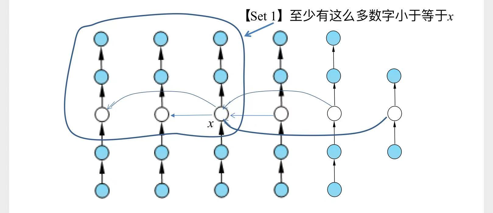
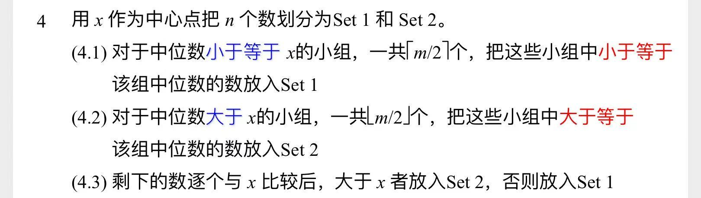

# 第 i 顺序数

# 一、分治法

## 1.1 底&分&合
跟[快速排序](计算机算法设计与分析/排序算法/快速排序.md)很像：

**分**：选取数组中的一个数作为`主元元素`，将数组切分为两部分  
**底**：左边数组正好有`k-1`个，那么`主元元素`就是要找的目标，直接返回  
**合**：不需要额外操作

> **快速排序**每次拆分后，需要分别去处理两个子问题。而这个问题中简单一些：
> 1. 左边数组元素个数>k-1时，去左边寻找目标即可，右半部分扔掉
> 2. 左边数组元素个数<k时，去右边寻找目标即可，左半部分扔掉

所以复杂度比[快速排序](计算机算法设计与分析/排序算法/快速排序.md)低

## 1.2 复杂度分析

### 1.2.1 最差情况

与[快速排序](计算机算法设计与分析/排序算法/快速排序.md)类似，每次选择最大或者最小元素，作为`主元元素`。复杂度 $O(n^2)$

### 1.2.2 最好情况

每次选择**中点**作为`主元元素`，则有：
$$
T(n) = T(\frac n 2) + O(n)
$$

由**主方法**规则3：
$$
T(n)=\theta(n)
$$

### 1.2.3 较好情况

[快速排序](计算机算法设计与分析/排序算法/快速排序.md)中我们分析过：  
即使每次没有划分成两个相同大小的数组，只要每次都按一定比例划分，复杂度就可以指数下降  
这个问题中也类似

证明过程

同样可以用**递归树**来推导。  
这节课中，张老师用**主方法**推导了一遍：

由于每次按照一定比例划分，那么一定存在 $\varepsilon>0$，使得左、右两部分数组中的元素个数，都 $> \varepsilon n$  
假设我们每次需要去规模大的那部分去搜索，那么有递推公式：
$$
T(n) \le T((1-\varepsilon)n) + O(n)
$$

- 上式中，$a=1，b=\frac 1 {1-\varepsilon}$
- 由**主方法**规则3：
$$
T(n)=\theta(n)
$$

# 二、进一步改进

通过上面的分析，我们知道`主元元素`的选取，对复杂度影响很大。  
接下来这种改进算法，就是尽量去找一个更合适的`主元元素`。

## 2.1 选取`主元元素`

- 示意图：

1. 每5个一组，组内排序，并选出`中位数`
2. 所有的`中位数`组成一个新数组，再去寻找这个新数组的`中位数`x，将这个找到的x作为`主元元素`

## 2.2 根据`主元元素`，将数组分为两部分

为了减少比较次数，尽可能地利用上一步已经获得的信息。伪代码如下：

## 2.3 底&分&合

算法其余部分，与上面介绍的**分治法**一致

## 2.4 复杂度分析

> 这部分感觉不重要，简单略过

1. 首先能够分析出`Set1`、`Set2`中的元素个数，均大于 $\frac {3n} {10} -4$
2. 然后推导出`Set1`、`Set2`中的元素个数，均小于 $\frac {7n} {10} + 4$
3. 于是得到递推关系：
$$
T(n) < T(\lceil \frac n 5 \rceil) + T(\frac {7n} {10} + 4) + an
$$
4. 用替换法解得：
$$
T(n) = \theta(n) \quad （常数因子为60）
$$
