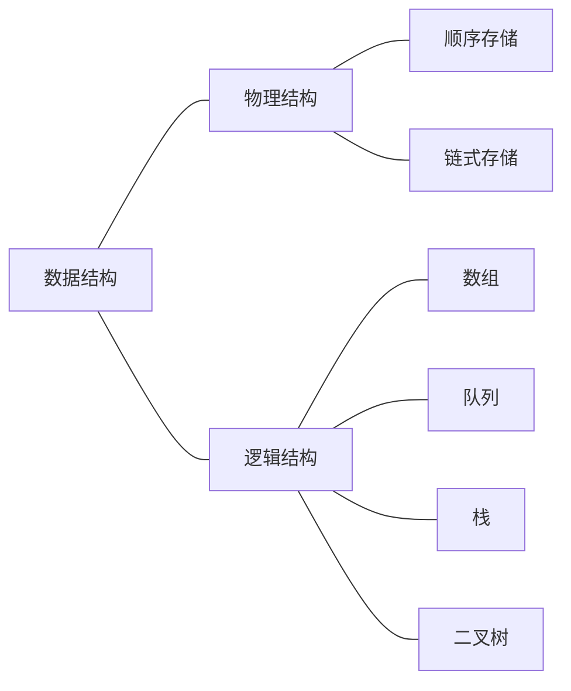
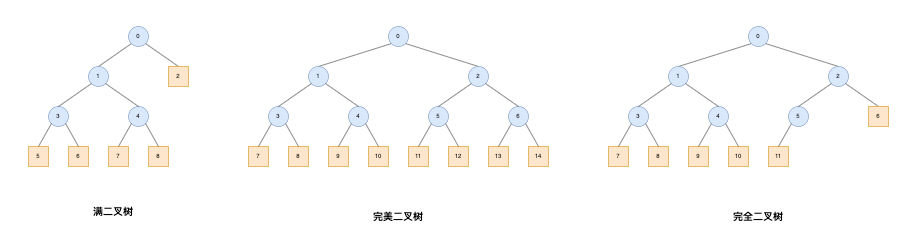
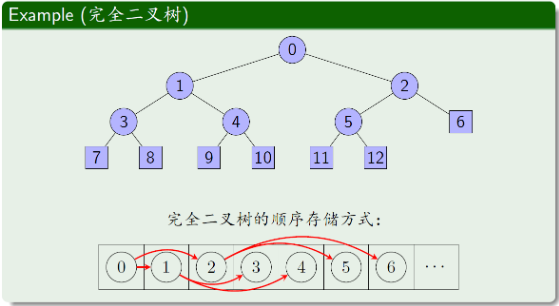

# 基本数据结构

# 一、回顾这些基本结构

# 二、几种二叉树

1. 满二叉树
    - 每个结点都恰有0个或2个子结点
2. 完美二叉树
3. 完全二叉树
    - 除最后一层外，都是满的
    - 相比前两种，更常见

- 额外补充
    > 树结构通常使用`链式存储`，而**完全二叉树**也可以用`顺序存储`  
    > 

# 三、二叉堆
> 使用完全二叉树，来实现一个最大堆  
> 第三章会详细介绍[堆排序](计算机算法设计与分析/排序算法/堆排序.md)