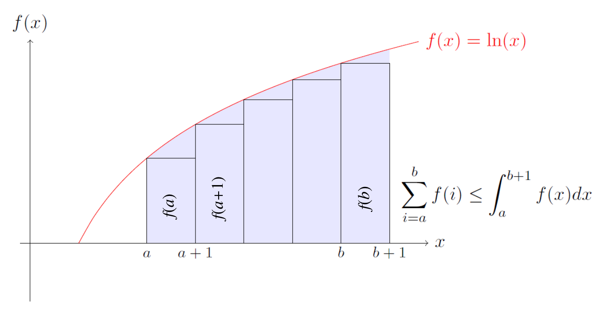
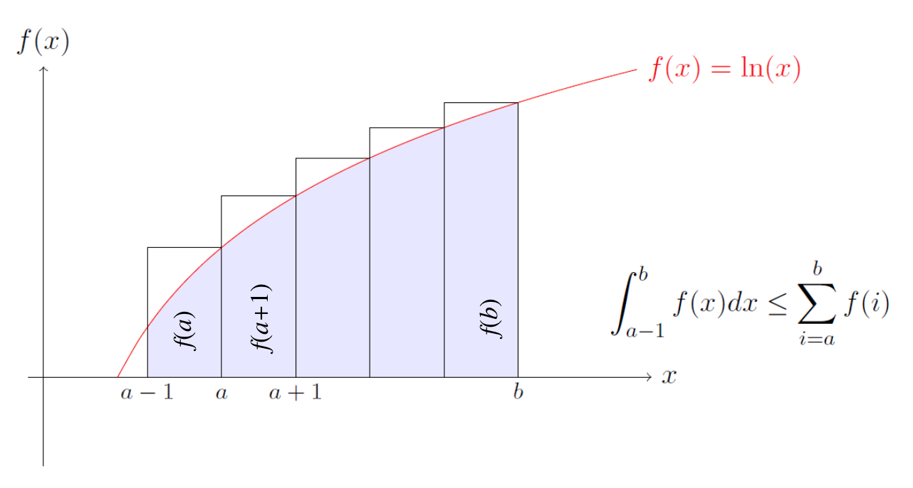

# 背景知识

# 一、集合
> 略

# 二、概率
> 略

# 三、代数
1. 对于数列求和，使用以下结论往往可以用积分来计算其近似值（或给出上下界）
    - 若f(x)是**增函数**，则
        $$
        \int_{a-1}^{b} f(x) dx \le \sum\limits_{i=a}^b f(i) \le \int_{a}^{b+1} f(x) dx \qquad (1)
        $$

        

        
<b>1. 证明右半部分</b>

        
        > $\sum\limits_{i=a}^b f(i)$ 对应图中各个矩形面积之和  
        > $\int_{a}^{b+1} f(x) dx$ 对应整个紫色区域的面积

        

        

        
<b>2. 证明左半部分</b>

        
        > $\int_{a-1}^{b} f(x) dx$ 对应紫色区域的面积  
        > $\sum\limits_{i=a}^b f(i)$ 对应图中各个矩形面积之和

        

    - 同理，若f(x)是**减函数**，则
        $$
        \int_{a}^{b+1} f(x) dx \le \sum\limits_{i=a}^b f(i) \le \int_{a-1}^{b} f(x) dx \qquad (2)
        $$
2. 接下来再看一个具体应用
    - 求**调和数**： $\sum\limits_{i=1}^{n} \frac 1 i$ 的近似上下界
        1. 上界
            $$
            \begin{aligned}
            \sum\limits_{i=1}^{n} \frac 1 i &= 1 + \sum\limits_{i=2}^{n} \frac 1 i \\
            & \le 1 + \int_{2-1}^{n} \frac 1 x dx \qquad 参考(2)式的右半部分 \\
            & = 1 + \ln n
            \end{aligned}
            $$
        2. 下界
            $$
            \begin{aligned}
            \sum\limits_{i=1}^{n} \frac 1 i & \ge \int_{1}^{n+1} \frac 1 x dx \qquad 参考(2)式的左半部分 \\
            & = \ln (n+1)
            \end{aligned}
            $$
    
    - 关于**调和数**的更多知识

        