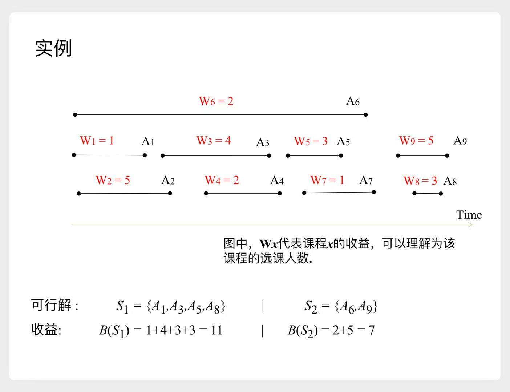
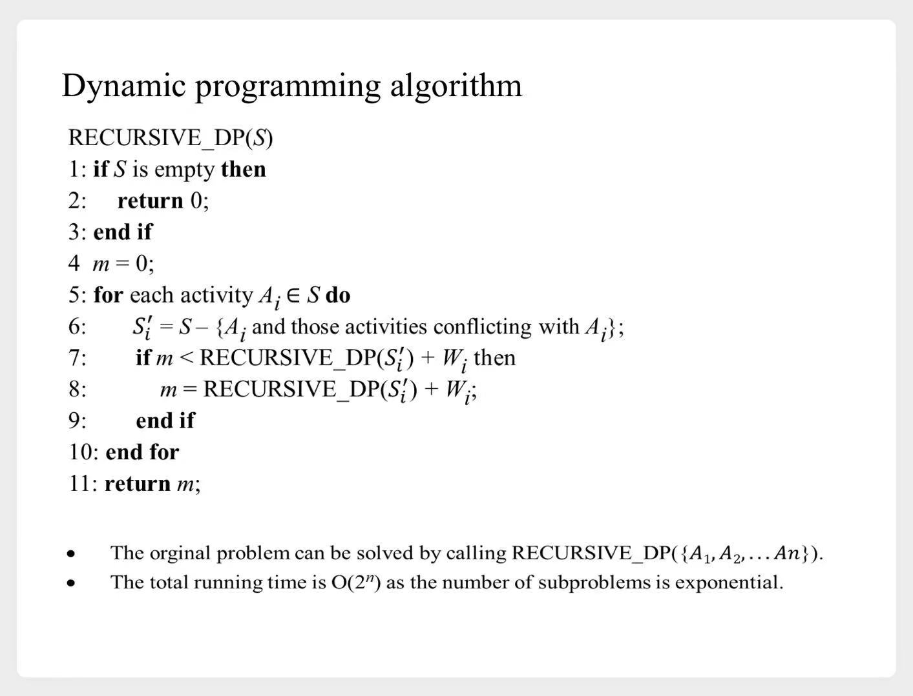
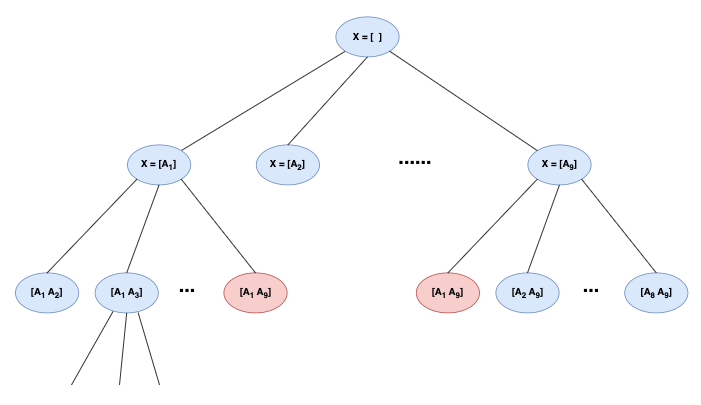
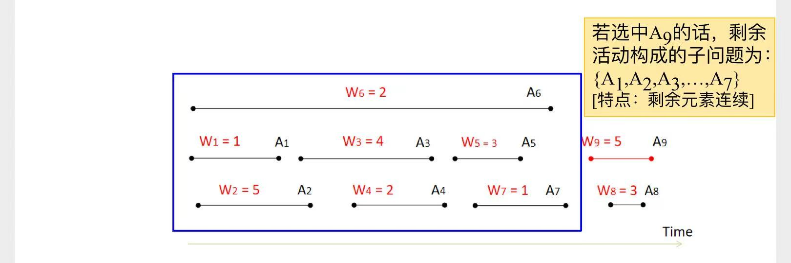
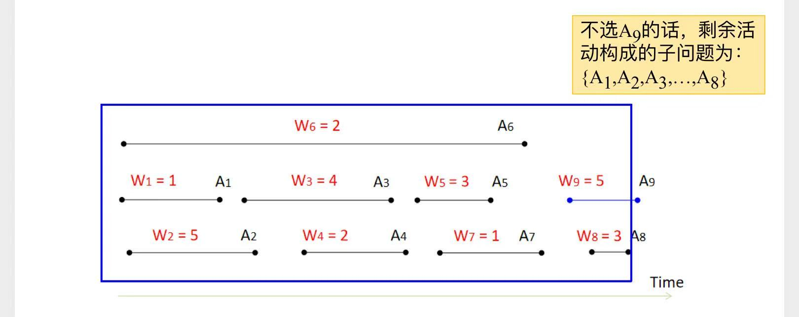
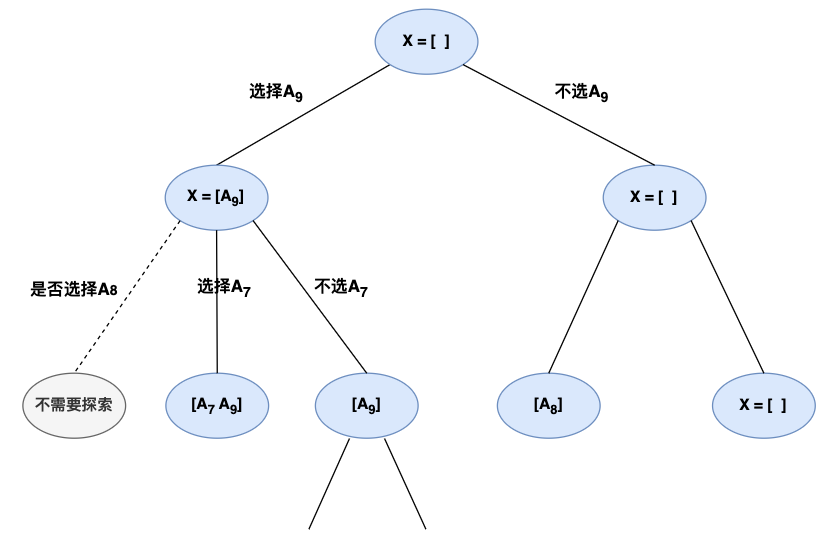
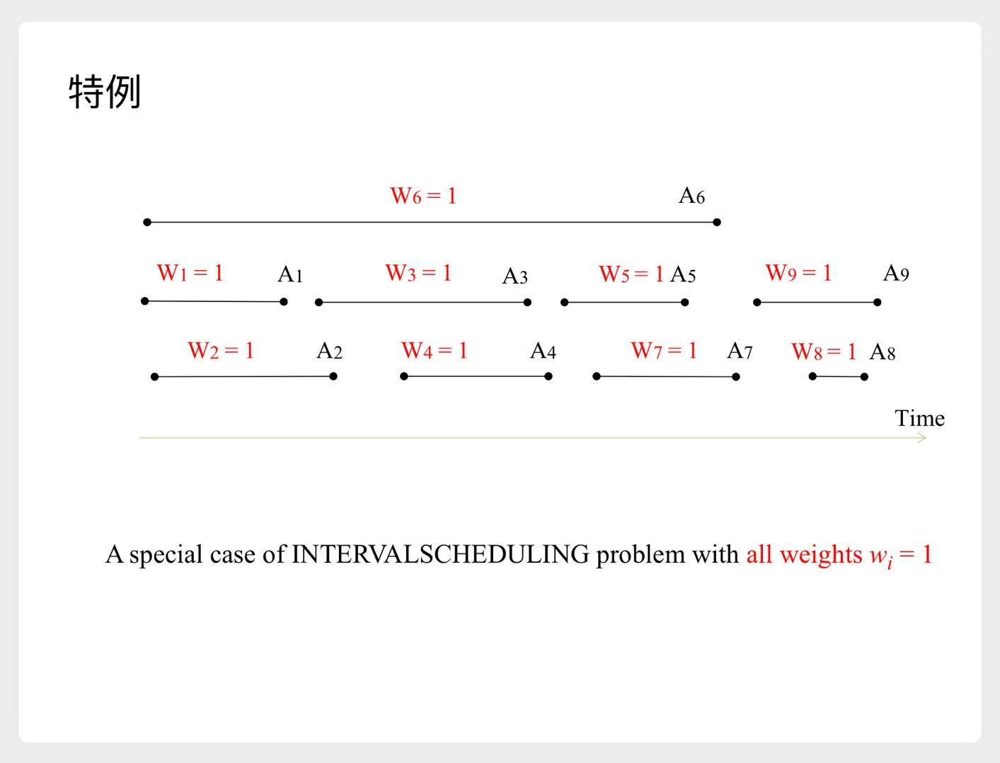
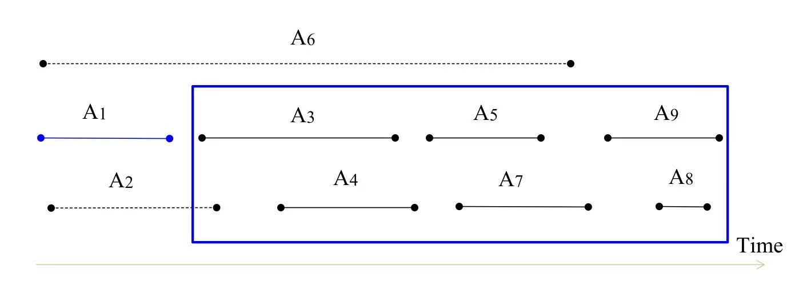
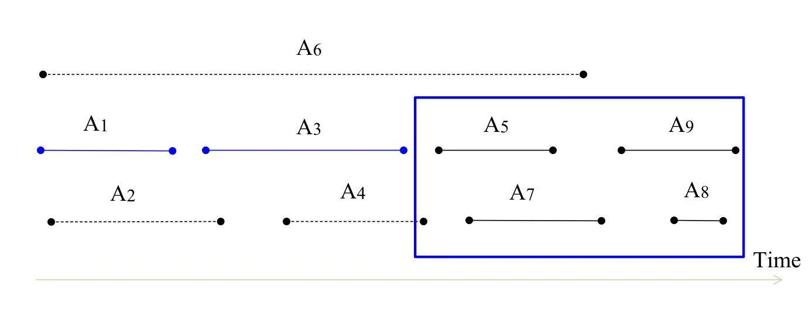
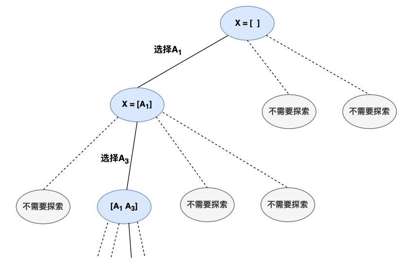

# 区间调度问题

# 一、带权区间调度

## 1.1 问题描述

## 1.2 递归求解

### 1.2.1 伪代码

### 1.2.2 决策树视角

### 1.2.3 复杂度分析

#### 1) 直接递归求解

1. 第一层有9个分支
2. 第二层，每个结点有8个分支
3. ...
- 复杂度为 $O(n!)$

#### 2) 加`备忘录`的递归 --> 动态规划

**决策树视角**中，我们能看到，会遇到重复问题。  
例如图中的 $X = [A_1, A_9]$

- 子问题数量：$O(2^n)$
- 划分数量：$O(n)$
- 复杂度：$O(n 2^n)$

## 1.3 另外一种 动态规划

### 1.3.1 递推公式

1. 首先我们将所有课程，按照结束时间排序
    - 例如$A_9$排在最后
2. 接下来只需要考虑两种情况：
    1. 选择$A_9$，那么接下来解决子问题$[A_1, A_2, A_3, A_4, A_5, A_6, A_7]$

        

        
示意图

        

        

    2. 不选$A_9$，那么接下来解决子问题$[A_1, A_2, A_3, A_4, A_5, A_6, A_7, A_8]$

        

        
示意图

        

        

- 于是就可以得到递推公式：
    $$
    OPT(i) = \max 
    \begin{cases}
    OPT(pre(i)) + W_i \\
    OPT(i-1)
    \end{cases}
    $$

### 1.3.2 决策树视角

> 可以看到，做了很多剪枝

### 1.3.3 复杂度分析

> 这里只分析了`+备忘录`后，对应`DP`算法的复杂度

1. 排序阶段：$O(n \lg n)$
2. DP阶段
    - 子问题数量：$O(n)$
    - 划分数量：2
    - 复杂度：$O(n)$

# 二、不带权的区间调度

## 2.1 问题描述

## 2.2 贪心算法

1. 首先我们将所有课程，按照结束时间排序
    - 例如$A_1$排在最前
2. 接下来证明了一个结论：
    - 最终的调度方案可能有很多种，其中一定有一种方案，包含$A_1$
3. 那么如何找到这种方案？
    1. 选择$A_1$，接下来去解子问题
        

        
示意图

        

        

    2. 选择$A_3$，接下来去解子问题
        

        
示意图

        

        

    3. ...

## 2.3 决策树视角

> 我们不需要探索整棵树，而是沿着某个路径走下去  
> 直到某个叶子结点，得到答案

## 2.4 更多思考

**贪心算法**最重要的是，怎么找到合适的贪心策略。  
只能自己多尝试了～

针对这个例题，老师还列举了几个失败的策略：
1. 优先选择**最早开始时间**的课程
2. 优先选择**课程最短**的课程
3. 优先选择**冲突最少**的课程

---

# 总结：递归 vs DP vs 贪心

1. 第一棵决策树，普通`递归`，复杂度较高
    - 第一棵决策树`+备忘录`，相当于`DP`，降低复杂度
2. 第二棵决策树，利用已知信息做**剪枝**，降低复杂度
    - `+备忘录`，相当于更快的一种`DP`
3. 第三棵决策树，**剪枝**！
    - 剪到只剩一条路！！
    - `贪心算法`