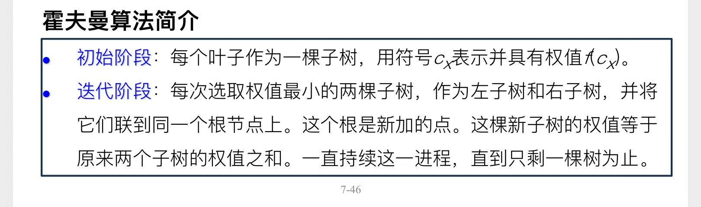
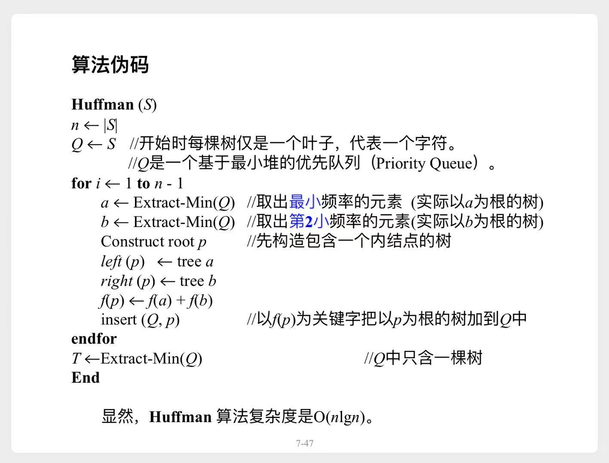

# 霍夫曼编码

# 一、引理

**最优前缀码树**可能有多种。  
假设`a`和`b`是所有字符中出现频率最小的两个字符，  那么存在这样一棵**最优前缀码树**：

#### `a`、`b`对应的叶结点在最底层，且拥有共同的父结点

> 证明略  

# 二、贪心算法

## 2.1 基本思路

> 初始阶段，问题规模为`n`。  
> 迭代阶段，每合并一次，都会变成一个`规模-1`的子问题。  

## 2.2 伪代码

## 2.3 复杂度分析

1. 外层循环，复杂度 $O(n)$
2. 循环内部，Extract-Min(Q)、insert(Q,p)，复杂度均为 $O(\lg n)$
- 整体复杂度 $O(n \lg n)$
