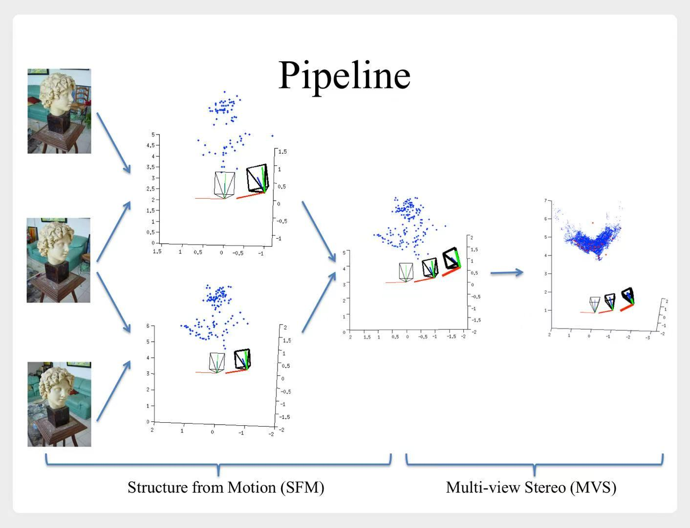
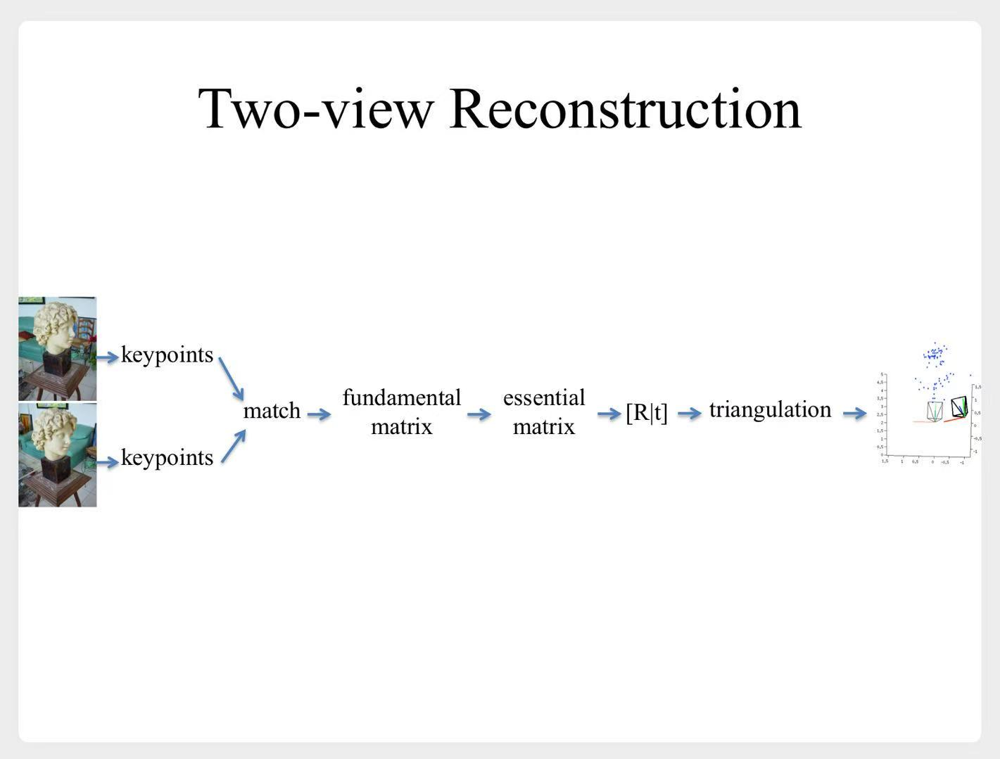
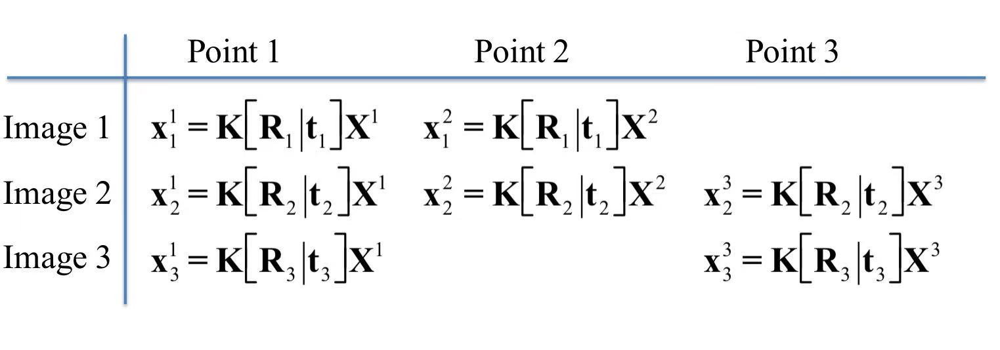
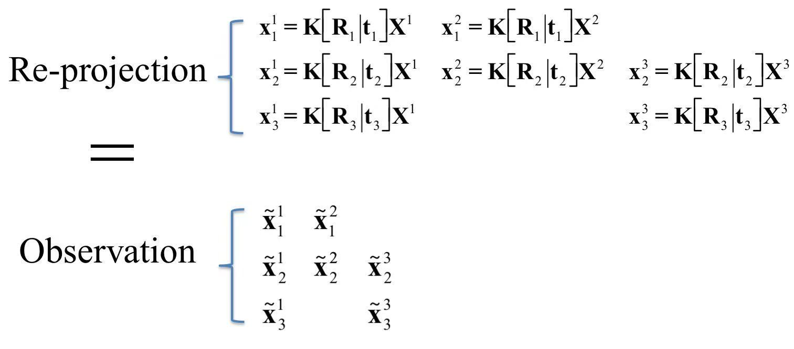

# 从运动恢复结构

> 用一个运动的相机，拍摄一系列二维图像，从而恢复物体的三维结构。

- 主要流程：
    1. 若干图片 --> 稀疏点云（Structure From Motion）
    2. 稀疏点云 --> 稠密点云（Multiple View Stereo）
    3. 模型拟合（Model Fitting）
    4. 纹理贴图（Texture Mapping）

课程上详细介绍了第一步，顺便提了一下第二步。

示意图

---

# 一、若干图片 --> 稀疏点云

## 1.1 两张图片 --> 稀疏点云

- 把之前学的概念都串起来了：
    1. 特征点匹配（SIFT）
        - 得到一些稀疏的对应点
    2. 估算**矩阵F**，这里又扩展了一下，介绍了3种方法
        1. **直接求解**：已经介绍过的8点检测法
        2. **几何误差**：最小二乘法，优化目标为：$\min \sum\limits_j d(x_1^j, Fx_2^j)^2 + d(x_2^j, F^T x_1^j)^2$
        3. **RANSAC**
    3. 如果相机**内参**已知，可以计算出**矩阵E**，即$[R|t]$
        - 如果相机**内参**未知，可以先估算一个**矩阵K**
    4. **三角测量**，估算出一系列稀疏对应点的坐标$P_w$

## 1.2 光束法平差（bundle adjustment）

由于有误差，1、2两张图片得到的`稀疏点云`，与2、3两张图片得到的`稀疏点云`，不会完全重合。  
所以我们要继续优化所有三维点的**位置**和所有相机的**位姿**（以及**内参**）

假设第一张图片上拍摄到两个点$X^1、X^2$，  
第二张图片上拍摄到两个点$X^1、X^2、X^3$，  
第三张图片上拍摄到两个点$X^1、X^3$。  
那么我们可以估算每个点在图像中的投影坐标：

我们期望计算出来的投影坐标，与原始图像中的坐标重合。

示意图

还是最小二乘法，优化目标为：
$$
\min \sum\limits_i \sum\limits_j (\tilde{x}_i^j - K[R_i|t_i]X^j)^2
$$

> $R、t、X$为未知参数  
> $K$也可能未知

# 二、稀疏点云 --> 稠密点云

简单提了一下：

前面已经构建好了**稀疏**的三维点云。  
如果某个点在多个图像里都能找到对应像素点，那么该点附近的区域，应该也能找到。  
从而扩充为**稠密**的三维点云