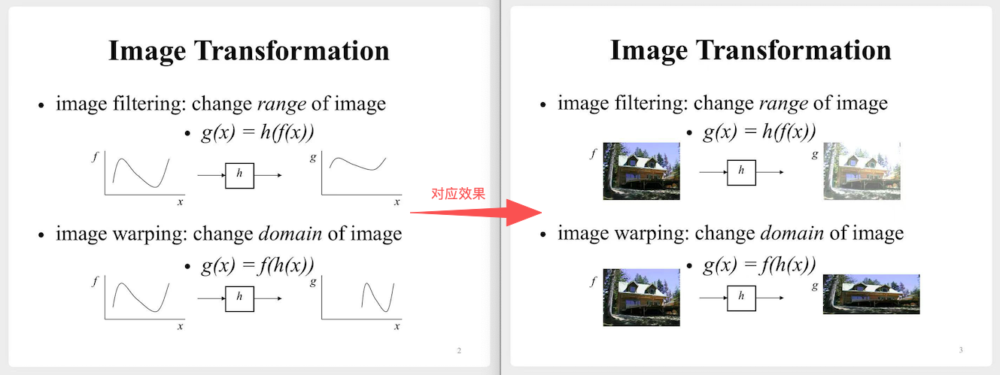
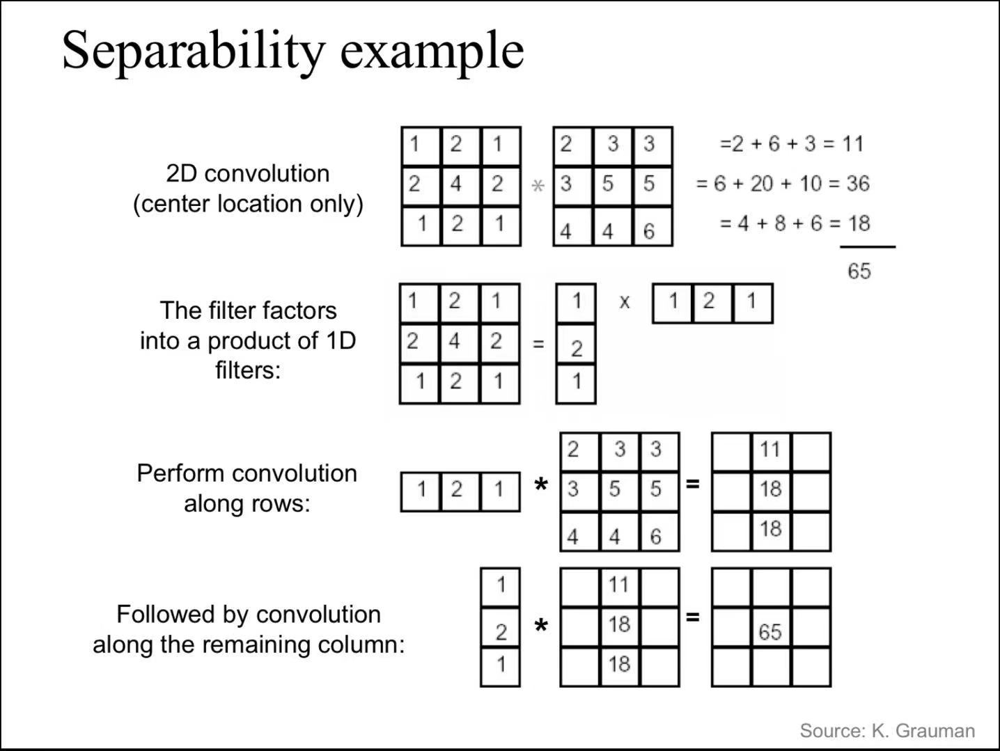
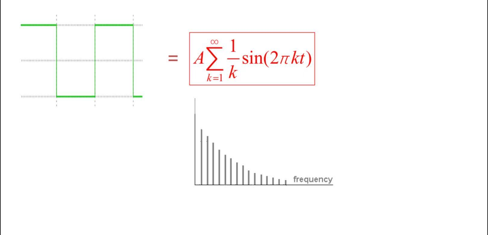
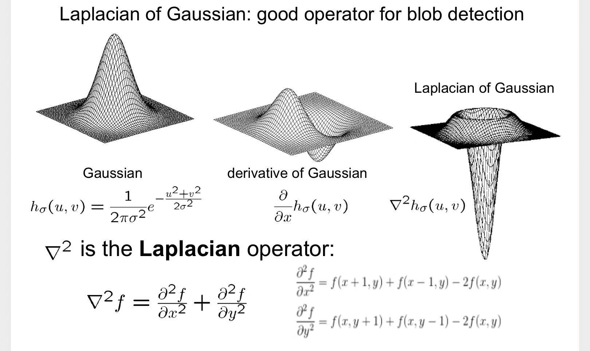
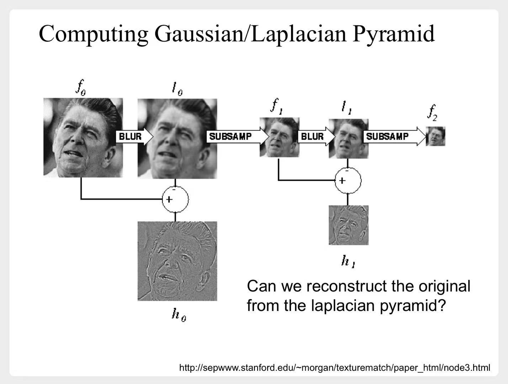

# 图像变换（transformation）

分别介绍下这两种变换：

---

# 一、图像变形（warping）

## 1.1 线性变换（linear）
1. 变换大小
$$
\begin{pmatrix}
    x' \\
    y' \\
\end{pmatrix} = 
\begin{pmatrix}
    s & 0 \\
    0 & s \\
\end{pmatrix}
\begin{pmatrix}
    x \\
    y \\
\end{pmatrix}
$$
2. 逆时针旋转
$$
\begin{pmatrix}
    x' \\
    y' \\
\end{pmatrix} = 
\begin{pmatrix}
    \cos \theta & - \sin \theta \\
    \sin \theta & cos \theta \\
\end{pmatrix}
\begin{pmatrix}
    x \\
    y \\
\end{pmatrix}
$$
3. 关于y轴对称
$$
\begin{pmatrix}
    x' \\
    y' \\
\end{pmatrix} = 
\begin{pmatrix}
    -1 & 0 \\
    0 & 1 \\
\end{pmatrix}
\begin{pmatrix}
    x \\
    y \\
\end{pmatrix}
$$

## 1.2 仿射变换（affine）
- 平移
$$
\begin{pmatrix}
    x' \\
    y' \\
    1
\end{pmatrix} = 
\begin{pmatrix}
    1 & 0 & t_x \\
    0 & 1 & t_y \\
    0 & 0 & 1
\end{pmatrix}
\begin{pmatrix}
    x \\
    y \\
    1
\end{pmatrix} =
\begin{pmatrix}
    x+t_x \\
    y+t_y \\
    1
\end{pmatrix}
$$
- 任何一个这样的矩阵，都是在做仿射变换：
$$
\begin{pmatrix}
    a & b & c \\
    d & e & f \\
    0 & 0 & 1
\end{pmatrix}
$$
- 1.1中的**线性变换**，也都是仿射变换

## 1.3 投影变换（projective）
更进一步，如果是这样的矩阵，就是在做投影变换：
$$
\begin{pmatrix}
    a & b & c \\
    d & e & f \\
    g & h & 1
\end{pmatrix}
$$

---

# 二、图像滤波（filtering）

- 从3个视角来理解**图像滤波**
    1. 直接在空间域，对图像做变换
    2. 先将图像转换到频域，再做变换
    3. 模版匹配 与 图像金字塔

## 2.1 空间域

### 2.1.1 滤波器

分别从一维、二维讲解了几种滤波器

1. 平均值滤波器
2. 高斯滤波器
    - 二维的高斯滤波器 等价于 计算两个一维滤波器叠加
    - 可以减少计算量

    

    
示意图

    
    

    

3. 微分滤波器
4. 中位数滤波器

### 2.1.2 计算相关度

其实就是计算两个向量之间的距离，介绍了3种方法

1. 欧氏距离
2. NCC（Normalized Cross Correlation）
    - 计算 $\cos \theta$
3. ZNCC（Zero-mean NCC）
    - 先将数据调整为均值=0，再计算 $\cos \theta$

## 2.2 频域

### 2.2.1 傅立叶变换

#### (1) 单个函数的傅立叶变换

1. 任何一个函数f(x)，都可以看作许多**正弦波**、**余弦波**的叠加

    

    
示意图

    

    

2. 频谱
    - 将每个**正弦波**、**余弦波**的`振幅`、`频率`汇总在一张图中，构成这个函数的**振幅谱**。

    

    
示意图

    

    

#### (2) 二维图像的傅立叶变换

1. 一个二元函数，可以看作许多**正弦平面波**的叠加
    - 理解不了，反正知道有个公式，可以计算。

2. 在空间域中进行复杂的卷积运算，等价于在频域中进行简单的乘法运算
    $$
    F[g * h] = F[g] F[h] \Longrightarrow g*h = F^{-1}[ F[g]F[h] ]
    $$
    - g*h 代表 一张图像与某个滤波器的`卷积运算`
    - 它等价于 图像、滤波器对应的傅立叶变换后的矩阵，做`点乘`，再做傅立叶逆变换
    - 可以简化`卷积运算`

### 2.2.2 采样

例如要缩小一张图片，可以每隔一个像素点，做一次采样。  
长、宽都变为原来的1/2。

#### (1) 奈奎斯特-香农采样定理（Nyquist-Shannon Sampling Theorem）

如果采样频率太低，例如每隔10个像素点，做一次采样。就会丢失很多信息。  
为了能够还原原始信息，这个定理告诉我们：  
**采样频率必须至少是原始图像中最高频率的 2 倍**

#### (2) 采样策略

- 所以我们需要按照这个流程来：
    1. 低通滤波器（如高斯）
        - 降低原始图像中的最高频率
    2. 采样

## 2.3 模版匹配 与 图像金字塔

### 2.3.1 计算相关度

内容与**2.1.2**大致相同

### 2.3.2 图像金字塔

由于我们不知道**模版**与**原始图像**是否做同一个`'level'`  
所以通常需要将**模版**与各个`'level'`的**图像**做匹配  
也就是“图像金字塔”

### 2.3.3 高斯-拉普拉斯算子（laplacian of gaussian）

构建“图像金字塔”的过程中，我们需要不断去 `高斯滤波`+`采样`  
这个过程中会不断丢失一些高频细节  
那么能不能从最小的那张图像，恢复原始图像呢？

- 引出来“**高斯-拉普拉斯算子**”

    1. 二维高斯函数
        $$
        h_{\sigma}(u, v) = \frac{1}{2\pi\sigma^2} \exp^{-\frac{u^2 + v^2}{2\sigma^2}}
        $$
    2. 拉普拉斯算子
        $$
        \nabla^2 f = \frac{\partial^2 f}{\partial x^2} + \frac{\partial^2 f}{\partial y^2}
        $$
    3. 将**拉普拉斯算子**应用于**高斯函数**，就得到了**高斯-拉普拉斯算子**：
        $$
        \nabla^2 h_{\sigma}(u, v)
        $$

    

    
示意图如下：

    
    

    

    

    
可以这样来近似计算

    
    

    

- 有了**高斯-拉普拉斯算子**，我们就可以构建**拉普拉斯金字塔**
    - 利用**拉普拉斯金字塔**，可以从最小的那张图像，恢复原始图像。

        

        
简易示意图

        
        

        
