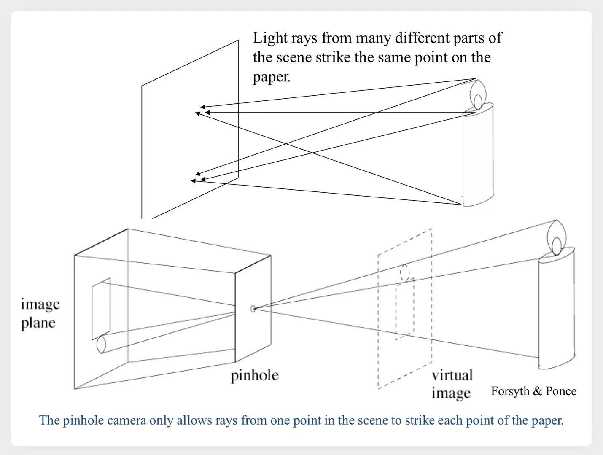
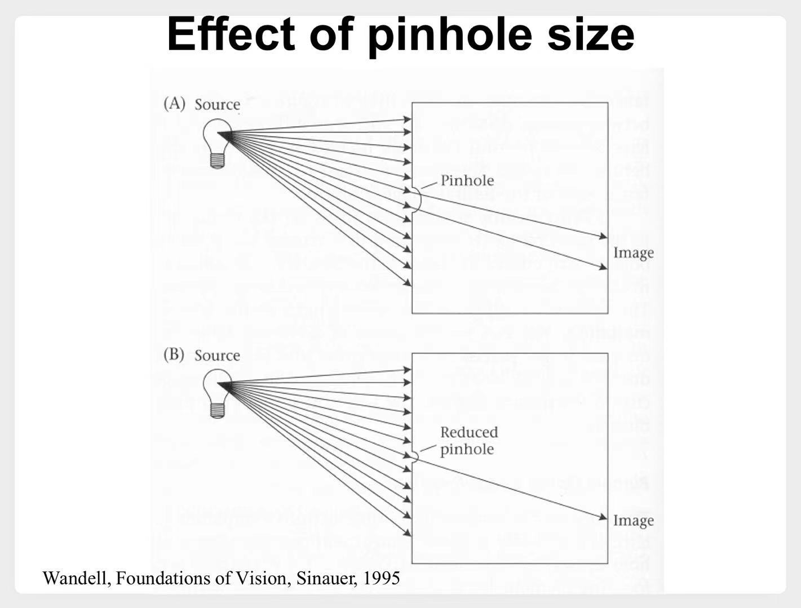
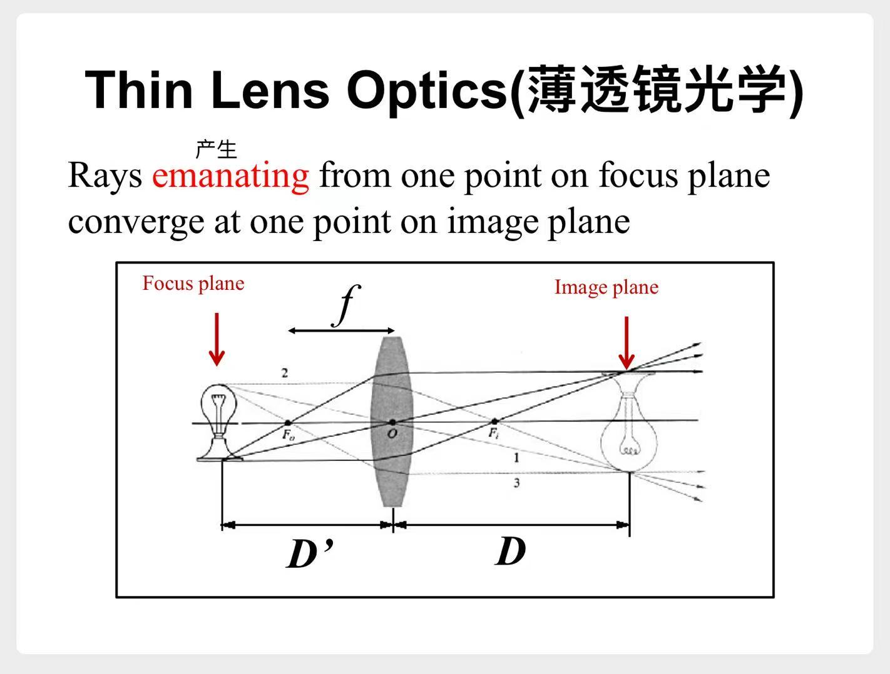
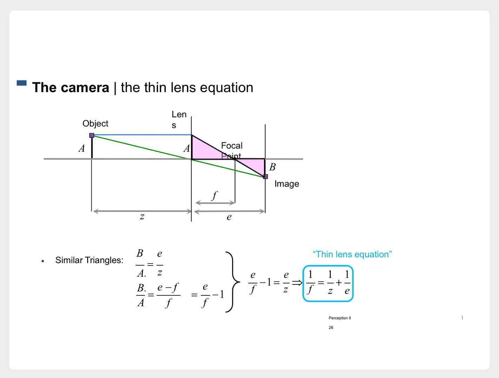
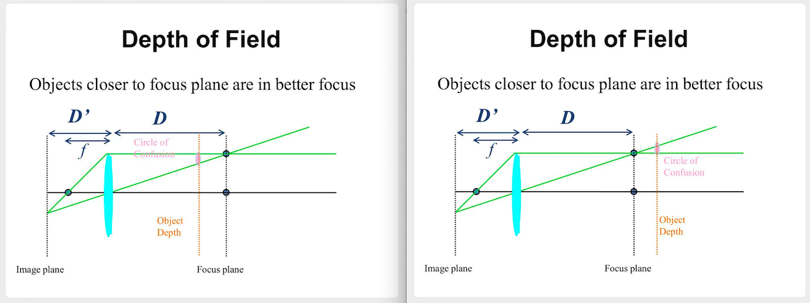
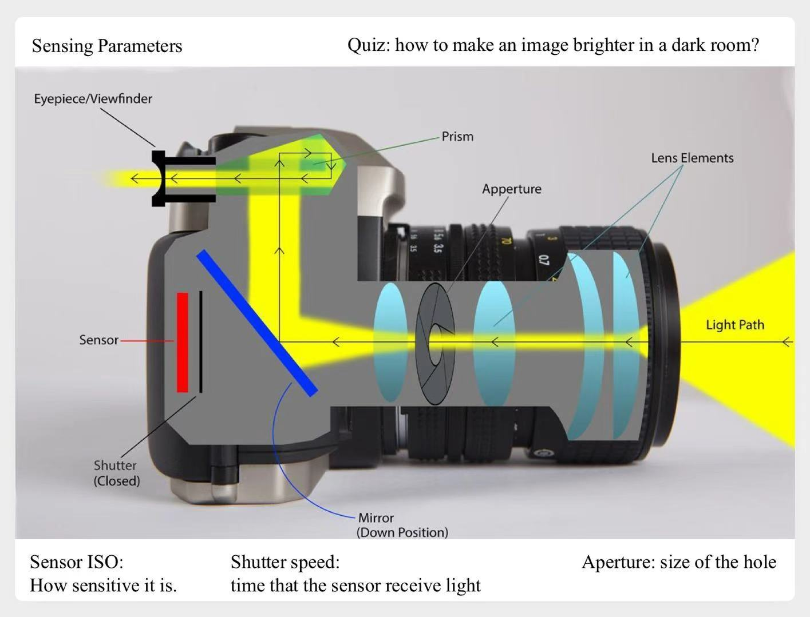

# 图像形成

# 一、传统小孔成像

# 二、光圈

**光圈**描述了小孔成像中孔的大小

1. 光圈过大，同一个点发出的光就会散落在多个点，成像模糊

    

    
示意图

    

    

2. 光圈较小时，往往由于进入的光线较弱，需要延长曝光时间。
3. 光圈过小，又会发生衍射现象，导致成像模糊

# 三、透镜

为了解决上述问题，引入透镜，来代替小孔

> 相当于添加了多个小孔，多个成像结果叠加  
> 只有在特定距离处（图中的D'），才能达到这种效果  
> 所以我们拍照时，需要对焦（即移动透镜的位置），来改变D'

物距$D$，像距$D'$，焦距$f$，有以下公式：
$$
\frac 1 {D'} + \frac 1 D = \frac 1 f
$$

证明过程

# 四、景深

可能老师是摄影爱好者吧，顺便介绍了一下**景深**的概念

通过对焦，可以使得待拍照物体，与镜头距离为$D$，我们就可以拍出一张很清晰的照片。  
实际上，待拍照物体附近的一些物品，只要与镜头的距离$\in [D-\delta, D+\delta]$，也很清楚。  
这就引出了一个**模糊圈**的概念

示意图

> 处于两个模糊圈之间的物体，成像都比较清晰

通过调整光圈，就可以调整两个**模糊圈**之间的距离
1. 光圈越大，两个**模糊圈**之间的距离越小，即$\delta$越小，我们就说景深越浅
2. 光圈越小，$\delta$越大，我们就说景深越深

    

    
示意图

    

    

> - 例如拍人物特写，我们就需要大光圈。
>   - 这样对焦的主体是清晰的。
>   - 距离镜头太近的“前景”、距离镜头太远的“背景”，都比较模糊，呈现“虚化”效果。  
> - 如果拍风光照，希望眼前的树木和远处的山脉都尽可能清晰，就需要小光圈。
>   - 让它们都在景深范围内。

# 附

最后附张图片，再熟悉一下这几个概念

