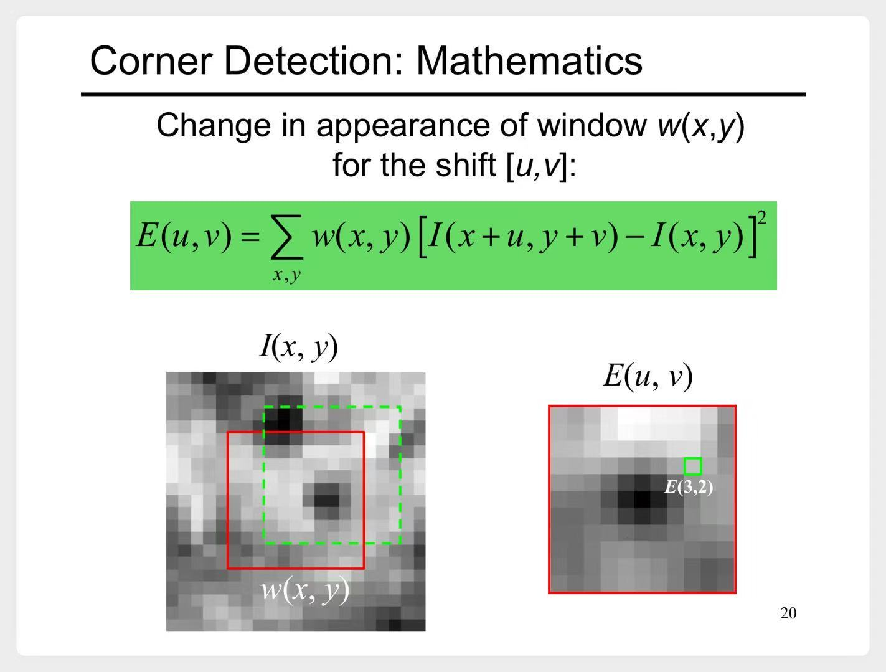
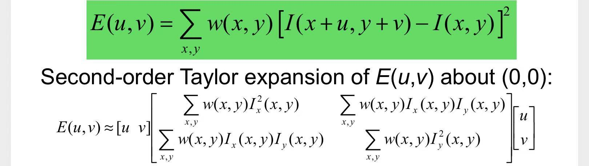
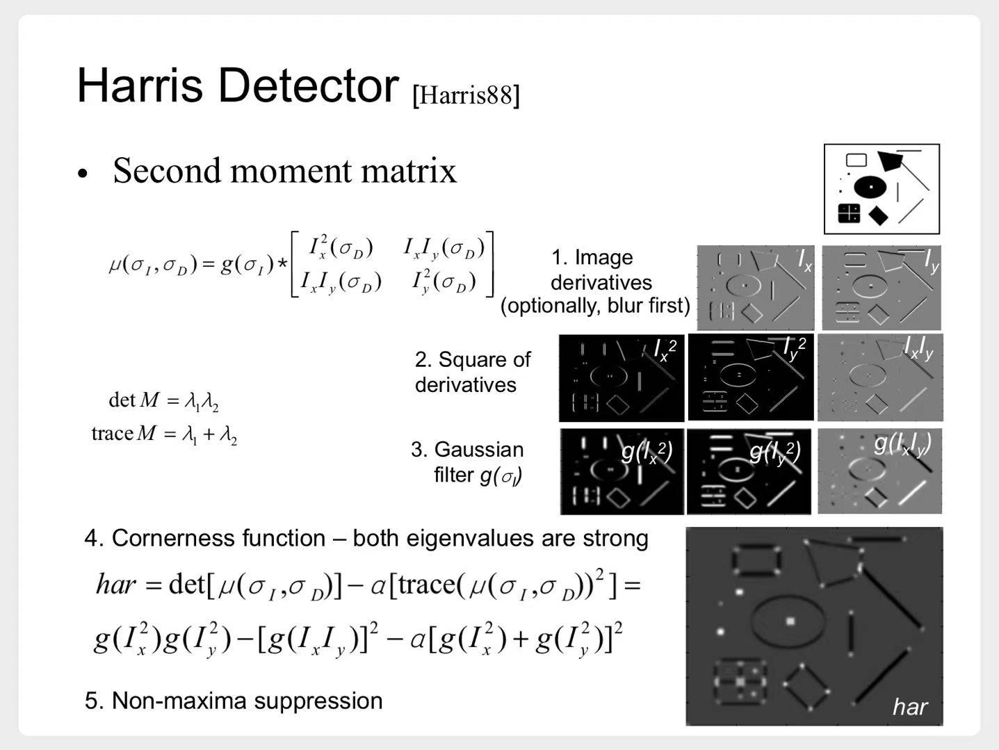
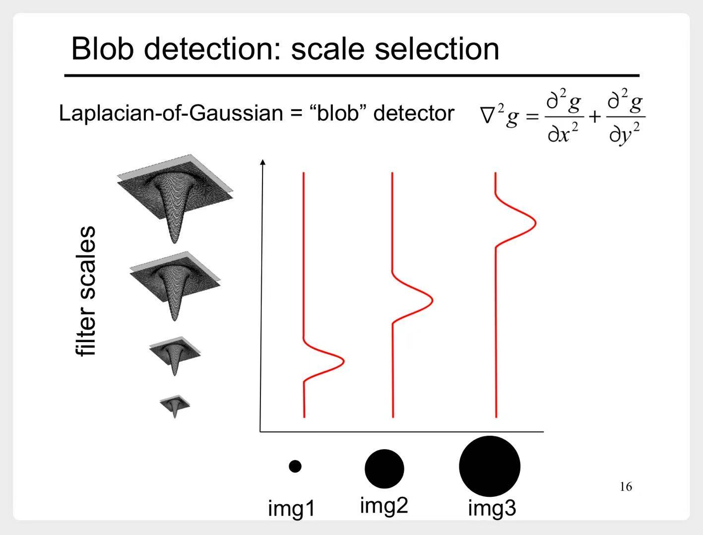
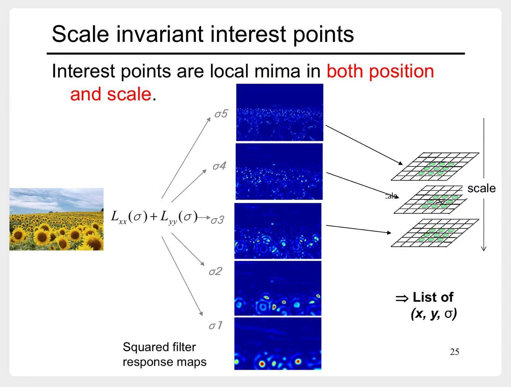
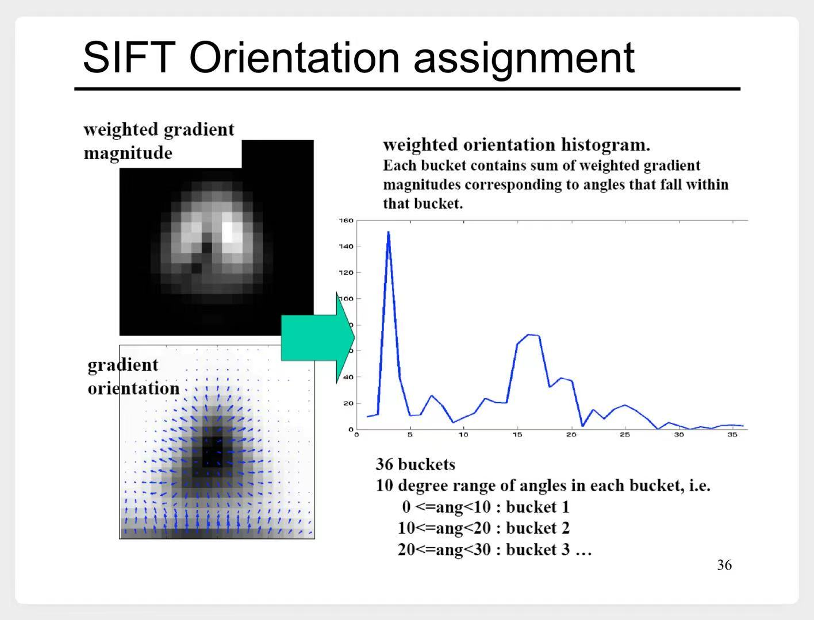
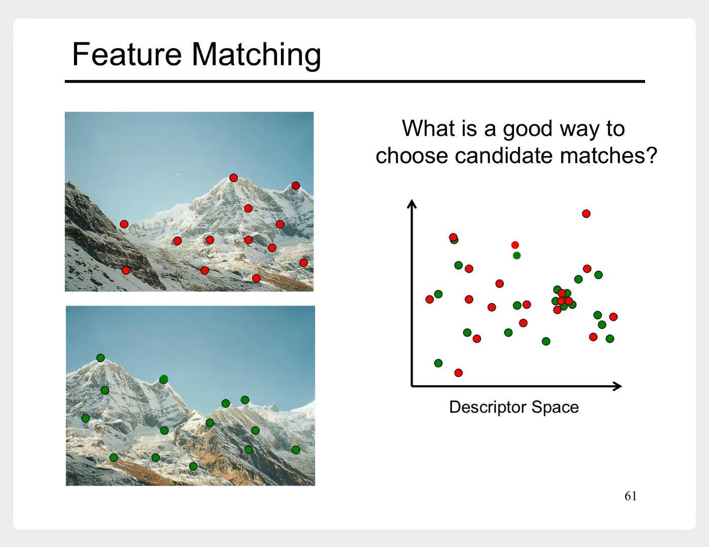
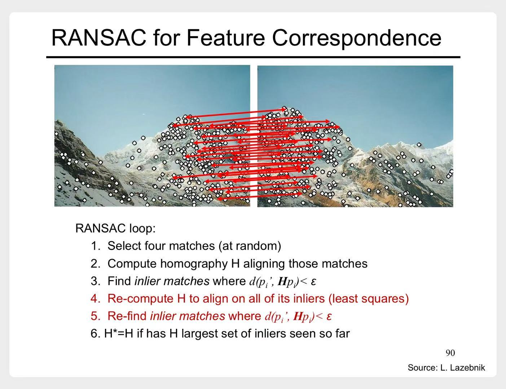

# 特征检测与匹配

- 图像特征匹配，分为这4步
    1. 特征检测
    2. 特征描述
    3. 特征匹配
    4. 特征对应

---

# 一、 特征检测

一个好的特征，需要有4个特性：
1. 可重复性
    - 图像经过几何变换、光学变换等，还可以找到
2. 显著性
    - 可区分
3. 高效性
    - 特征的数量要比图像像素少很多
4. 本地性
    - 基于图像中一小块区域就可以计算

## 1.1 角点检测（corners）

### 1.1.1 推导过程

1. 定义一个函数E(u,v)，来衡量当窗口偏移时，图像的变化程度

    

    
<b>示意图</b>

    
    > E(3,2)表示从红框到绿框，图像的变化程度

    

2. E(u,v)是一个二元函数，在(0,0)处对其二阶泰勒展开

    

3. 中间这个大矩阵，记为M。我们将它简写为：
$$
M = 
\begin{bmatrix}
\sum I_x I_x & \sum I_x I_y \\
\sum I_x I_y & \sum I_y I_y 
\end{bmatrix}
$$

4. 接下来重点分析**M矩阵**
    1. 如果图像在水平方向没有变化，$I_x=0$，此时**M矩阵**只有一个特征值$\lambda$
    2. 如果图像在竖直方向没有变化，$I_y=0$，此时**M矩阵**只有一个特征值$\lambda$
    3. 对**M矩阵**进行特征值分解：
        $$
        M = W 
        \begin{bmatrix}
        \lambda_1 & 0 \\
        0 & \lambda_2 
        \end{bmatrix}
        W^{-1}
        $$
        - 与前两种情况类似，有这样的结论：
            ||是否为角点|
            |---|---|
            |$\lambda_2 >> \lambda_1$|水平方向没有明显变化|
            |$\lambda_2 << \lambda_1$|竖直方向没有明显变化|
            |$\lambda_2、\lambda_1$都很小|都没有明显变化|
            |$\lambda_2、\lambda_1$都比较大|`yes`|
    4. 于是定义了一个响应函数来区分这几种情况：
        $$
        R = det(M) - \alpha \ trace(M)^2 = \lambda_1 \lambda_2 - \alpha (\lambda_1 + \lambda_2)^2 \qquad \alpha通常为 0.04至0.06
        $$
        - 再补充一下上面这张表格：
            ||$R$|是否为角点|
            |---|---|---|
            |$\lambda_2 >> \lambda_1$|$R<0$|水平方向没有明显变化|
            |$\lambda_2 << \lambda_1$|$R<0$|竖直方向没有明显变化|
            |$\lambda_2、\lambda_1$都很小|$R \approx 0$|都没有明显变化|
            |$\lambda_2、\lambda_1$都比较大|$R>0$|`yes`|

### 1.1.2 检测流程

- 上一节分析了这么多，最后得出一个非常简单的检查流程：
    1. 对图像中的每个小区域（window）计算**M矩阵**
    2. 计算**响应函数R**，**响应函数R**较大的区域，即为**角点**

- 老师给了一个更详细的流程
    

    
示意图

    

    > 1. 使用**微分滤波器**，计算每个像素点的$I_x、I_y$
    >     - 计算微分前，可以考虑先进行高斯滤波，使图像更平滑
    > 2. 计算每个像素点的$I_x^2、I_y^2、I_xI_y$
    > 3. 对$I_x^2、I_y^2、I_xI_y$，进行高斯滤波，便可以得到每个小区域的$\sum I_xI_x 、\sum I_xI_y、\sum I_yI_y$
    >     - 高斯滤波器的参数 $\sigma$，控制了区域窗口大小。
    >     - 相当于得到了每个区域的**M矩阵**
    > 4. 计算每个小区域的**响应函数R**
    > 5. **非极大值抑制**
    >     - 如果一个区域的**响应函数R**很大，那么它附近区域的**响应函数R**也会比较大。
    >     - 我们只保留一个局部最大值即可。也就是把那些**非极大值**，都抑制掉。

    

### 1.1.3 不变性（invariance）

1. 图片平移、旋转，**角点检测**仍然有效
2. 图片大小改变，**角点检测**就失效了

## 1.2 SIFT（Scale-Invariant Feature Transform）

### 1.2.1 高斯-拉普拉斯算子（Laplacian of Gaussian, LoG)

首先回顾了一下**高斯-拉普拉斯算子** $\nabla^2 G(x, y, \sigma)$，介绍该算子的作用：

- 不同的 $\sigma$ 值，可以检测不同大小的斑点
    - $\sigma$ 在这里也称作**尺度参数**

    

    
示意图

    
    

    

- 将变化尺度的**高斯-拉普拉斯算子**，与原图像做卷积，就可以检测出该图像中，不同尺度的特征点。

    

    
示意图

    

    > - 解释一下上图中的$L_{xx}(\sigma)+L_{yy}(\sigma)$
    >   1. 高斯模糊图像$L(x,y,\sigma)$ ：高斯函数 $G(x,y,\sigma)$ 与原图像 $I(x,y)$ 的卷积，即：
    >   $$
    >   L(x,y,\sigma) = G(x,y,\sigma) * I(x,y)
    >   $$
    >   2. 将**拉普拉斯算子**应用于$L(x,y,\sigma)$，可得到：$L_{xx}(x,y,\sigma)+L_{yy}(x,y,\sigma)$  
    > - 上面这两步，等价于 **高斯-拉普拉斯算子**$\nabla^2 G(x, y, \sigma)$ 与原图像做卷积

    

### 1.2.2 高斯差分函数（Difference of Gaussian, DoG）

1. 为了进行跨尺度的公平比较，我们需要对**LoG**进行`尺度归一化`。
    - 公式很简单，在原来**高斯-拉普拉斯算子**$\nabla^2 G(x, y, \sigma)$的基础上，乘 $\sigma^2$：
    $$
    \sigma^2 \ \nabla^2 G(x, y, \sigma)
    $$
2. 而这个`尺度归一化`的**LoG**，可以用**DoG**来近似，从而加速计算：
    $$
    DoG(x,y,\sigma,k) = G(x,y,k \sigma)−G(x,y,\sigma) \approx (k-1) \sigma^2 \ \nabla^2 G(x, y, \sigma)
    $$
- 所以我们可以用**DoG**与原图像做卷积，来检测特征点

#### 更多内容

1. 构建DoG金字塔
2. 去除 对比度低 的点
3. 去除 边缘响应点

### 1.2.3 关键点的方向匹配

为了使**特征描述**具有旋转不变性，需要为每个关键点分配一个基准方向

1. 根据关键点所在的尺度$\sigma$，选择该尺度的高斯模糊图像 $L(x, y, \sigma)$
2. 计算每个像素点的$I_x、I_y$
3. 计算每个像素点的**梯度幅值**、**方向**
    $$
    m(x, y) = \sqrt {I_x^2 + I_y^2} \\
    \theta(x, y) = \arctan \frac {I_y} {I_x}
    $$
4. 生成**方向直方图**
    - 将**方向**划分为36个bucket
    - 将所有像素的**梯度幅值**，按它们的梯度**方向**，以高斯加权的方式累加到对应的bucket中。
        - 权重为**梯度幅值**乘以一个以关键点为中心的高斯窗口

    

    
示意图

    
    

    

5. 确定**主方向**
    - 直方图中的最高峰。还可以有多个**辅方向**

### 1.2.4 示意图

通过**SIFT**找到的特征点，就有三个信息：位置、尺度、方向。

示意图

---

# 二、特征描述

这节介绍**SIFT描述符**。有了前面的基础，这部分就好理解多了。

1. 确定描述区域
    - 根据关键点的尺度，确定描述的区域范围，确保尺度不变性。
    - 将坐标轴旋转到关键点的主方向，确保旋转不变性。
2. 计算区域梯度
    - 在旋转后的 16x16 的窗口内，计算每个像素的梯度幅值和方向。
3. 生成方向直方图描述子
    - 将这个 16x16 的窗口划分为 4x4 的子区域（共16个）。
    - 对于每个 4x4 的子区域，计算一个8个bucket的方向直方图。
4. 形成特征向量
    - 将16个子区域的8维直方图数据连接起来，形成一个 16 * 8 = 128 维的特征向量。
    - 这就是最终的**SIFT描述符**。

---

# 三、特征匹配

这部分很简单，老师列举了几种匹配方式。  
其中效果最好的是**mutual closest method**

---

# 四、特征对应

## 4.1 投影变换

首先回顾了一遍[图像变换](计算机视觉/基于特征的计算机视觉技术/图像变换.md)中**投影变换**的内容。  
任选4对特征点，可以计算出相应的投影矩阵H

## 4.2 RANSAC（RANdom SAmple Consensus）

