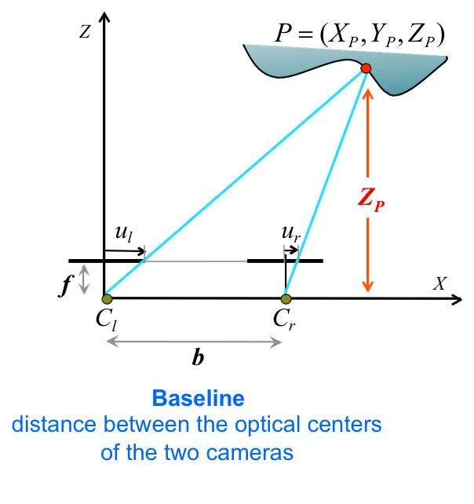
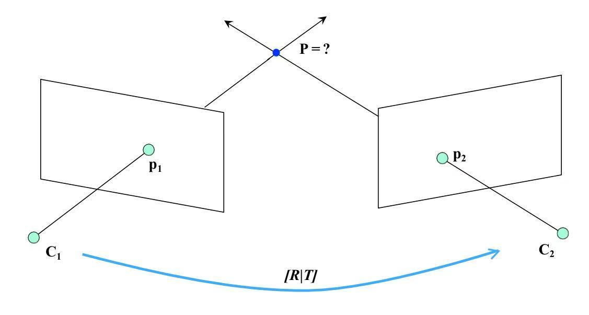
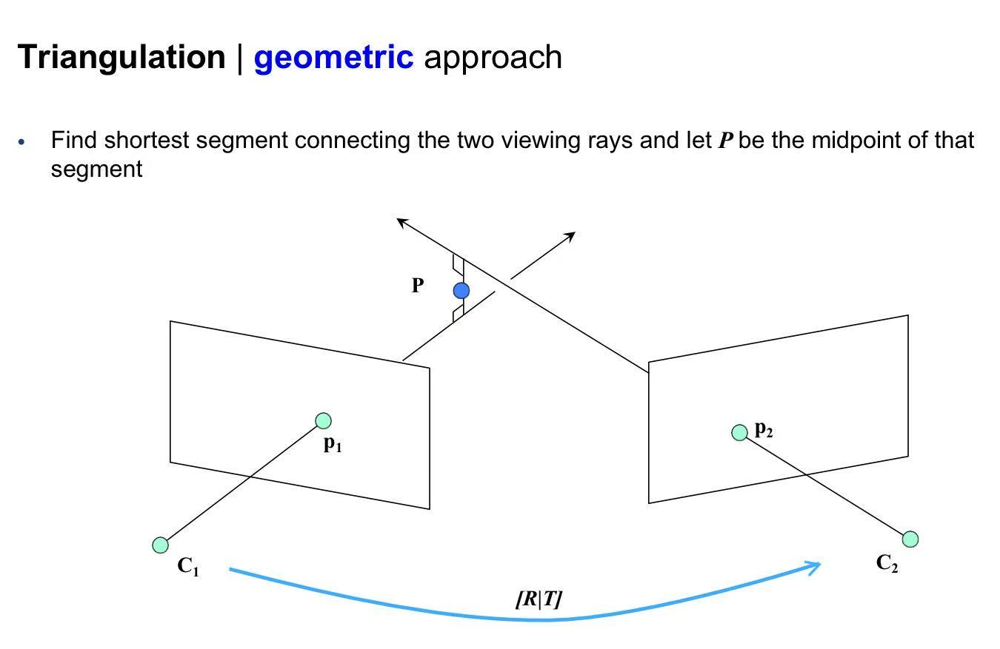
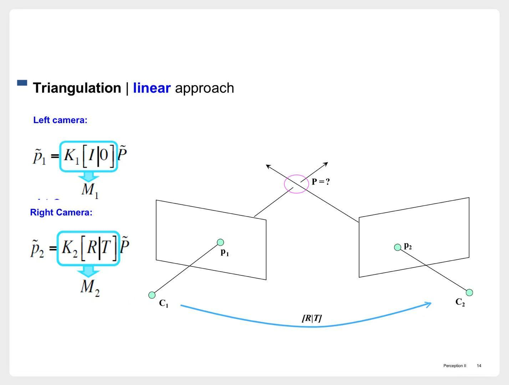
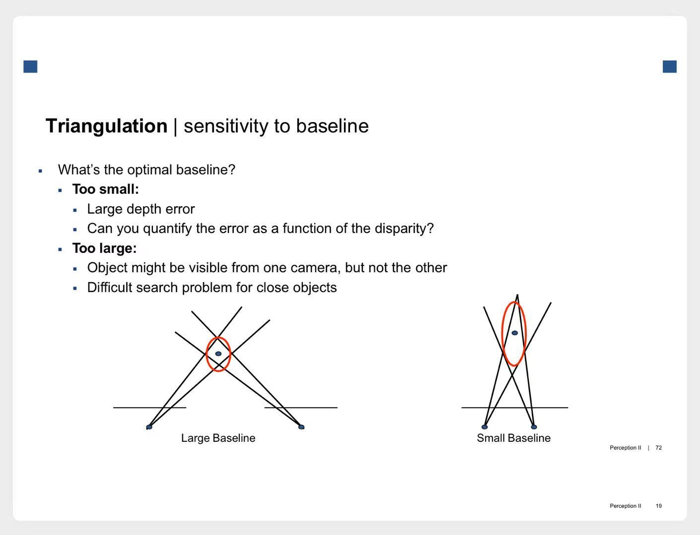
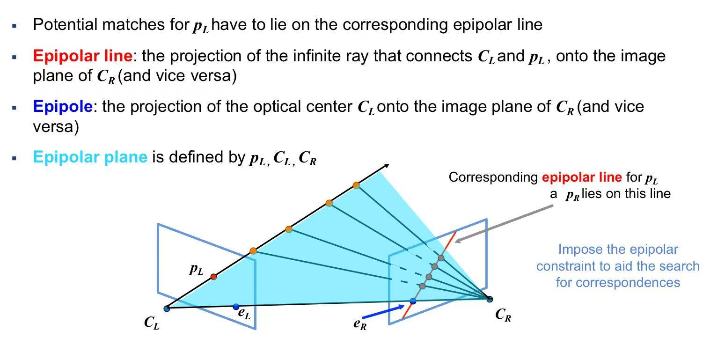
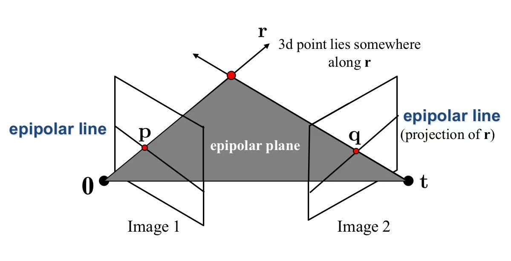
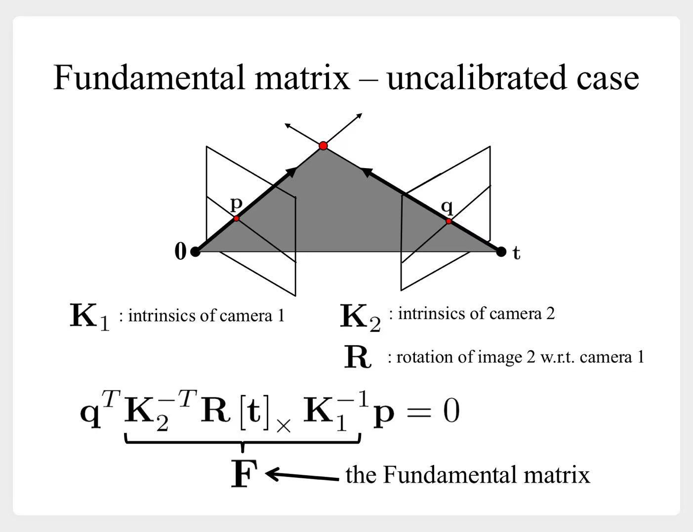
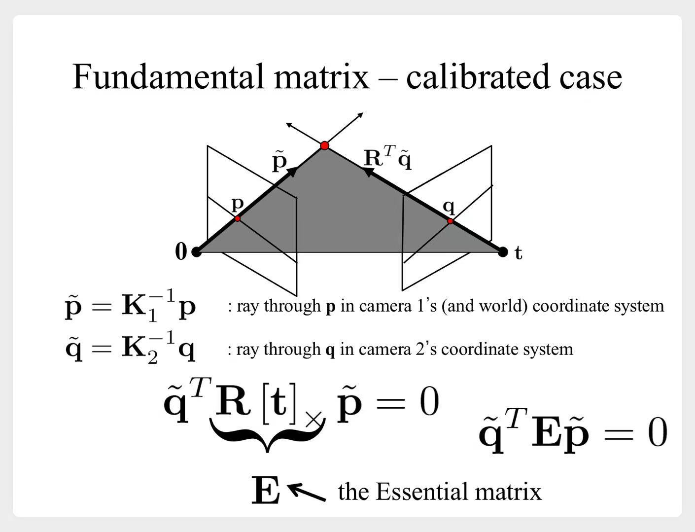
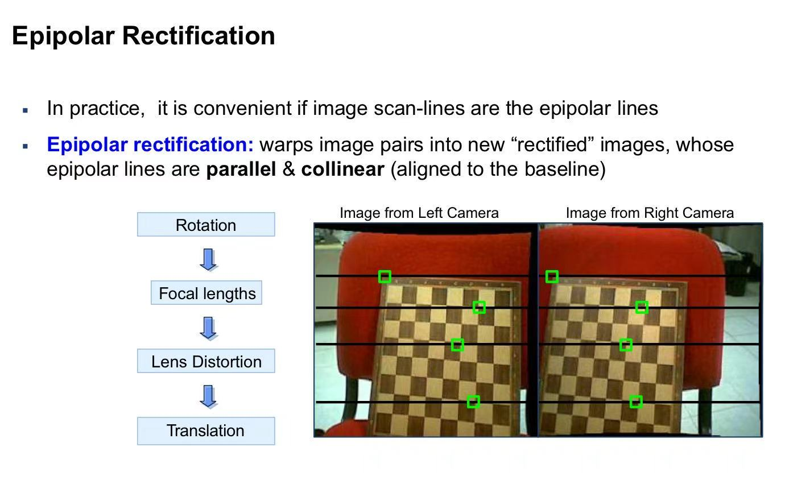

# 立体视觉与双视图几何

# 一、立体视觉

一个相机拍照时，无法判断拍照物到相机的距离。  
需要用两个相机。

## 1.1 简单情况

**理想情况**：两个平行相机

示意图

建立方程组，就可以解出$Z_p$
    $$
    \begin{cases}
    \frac {u_l} f = \frac {X_p} {Z_p} \\
    \\
    \frac {u_r} f = \frac {X_p - b} {Z_p} 
    \end{cases}
    \Rightarrow Z_p = \frac {bf} {u_l - u_r}
    $$

- 所以可以这样来检测距离：
    1. 找到两张照片中所有相互对应的像素点
    2. 每队像素点，都可以计算$u_l - u_r$
        - $u_l - u_r$称为**视差(disparity)**
    3. 估算$Z_p$

## 1.2 一般情况：三角测量（triangulation）

- 需要考虑到这些参数：
    1. 两个相机的“**位姿**”不同，即**外参**不同
    2. 两个相机不可能完全一样，即**内参**不同
    - 可以先用[视觉几何与摄像机标定](计算机视觉/基于特征的计算机视觉技术/视觉几何与摄像机标定.md)提到的**多平面校准**，计算出**内参**、**外参**
- 稍微简化一下：
    1. 首先假设真实世界的坐标系，与第一个相机的坐标系重合。
        - 于是第一个相机的**外参**$[R|T]=[I|0]$。
    2. 第二个相机的**外参**为$[R|T]$

理想情况

> 两个相机**内参**完全一样，$C_1P_1、C_2P_2$两条射线会相交于一点

但是由于相机**内参**不同，$C_1P_1、C_2P_2$两条射线不会相交。  
此时怎么确定P点呢？

**寻找距离两条射线最近的那个点**

几何意义

###  1.2.1 直接求解

> 如上图所示，$\tilde{p}_1、\tilde{p}_2、M_1、M_2$均已知。  
> 需要计算$\tilde{P}$的坐标。  
> 6个方程，3个未知数，使用**SVD（奇异值分解）**来求解

###  1.2.2 最小化平方误差

通过最小化这个误差，来估算P点的坐标：
$$
SSRE = ||p_1 - M_1 P ||^2 + ||p_2 - M_2 P ||^2
$$

熟悉的套路：
1. 直接求解，先得到初始的P点坐标
2. 最小化平方误差，迭代寻找最优解

### 1.2.3 对baseline比较敏感

如果baseline太小，预测误差就会比较大

示意图

> baseline即两个相机间的距离。可以回顾下**1.1 简单情况**中的示意图

---

# 二、双视图几何

## 2.1 基本概念

### 2.1.1 极点、极线、极平面

> **极平面**：$p_L、C_L、C_R$三点组成一个平面。  
> **极线**：**极平面**与右边的相平面，相交于一条直线。$p_L$所对应的点$p_R$，一定落在这条直线上。  
> **极点**：直线$C_L C_R$与两个相平面的交点。当然也在**极平面**上

另一个示意图

### 2.1.2 基础矩阵F、本质矩阵E

1. 基础矩阵F
    $$
    F = K_2^{-T} R [t]_X K_1^{-1}
    $$

    

    
示意图

    

    

2. 本质矩阵E
    $$
    E = R [t]_X
    $$

    

    
示意图

    

    

### 2.1.3 基础矩阵F --> 极线

> $左图中p点，在右图中对应的极线为：Fp$

## 2.2 两个应用：
1. 已知**内参**、**外参**，去寻找**对应点**
2. 已知**对应点**，去计算**基础矩阵F**

### 2.2.1 寻找对应点

给出两张图片，寻找图片中对应的像素点。

#### 1) 暴力求解

遍历所有情况，复杂度$O(n^2)$，不可取。

#### 2) 在极线搜索

当两个相机的**内参**、**外参**都已知时，就可以计算出左图中某个像素点，在右图中对应的**极线**。  
于是我们只需要去**极线**上寻找对应点。

#### 3) 极线整流（epipolar rectification）

通过图像变换，让这两幅图像上的“对应极线”变得**水平且对齐**。
这样可以更快地去寻找对应点。

示意图

> 具体流程没理解，感觉大概意思是这样：
> 1. 旋转：消除**R矩阵**的差异
> 2. 消除**K矩阵**的差异
> 3. 畸变矫正
> 4. 平移

### 2.2.2 计算基础矩阵

#### 1) F矩阵的性质

1. F矩阵是3x3矩阵，秩为2
2. 给定两张图片的对应点，我们有${x'}^T F x = 0$

#### 2) 8点检测法

1. 寻找8对`对应点`
    - 例如[特征检测与匹配](计算机视觉/基于特征的计算机视觉技术/特征检测与匹配.md)中介绍的**SIFT**
2. 每一对`对应点`，可以建立一个方程${x'}^T F x = 0$
    - 8个方程，联立求解。
    - $F$矩阵是3x3矩阵，有9个未知数。可以令最后一个参数$f_33=1$，去求解剩下8个。所以8个点就够了。
3. SVD
    - 已知F矩阵的秩为2，现在计算出来的秩为3。所以需要进一步处理，即SVD
    - 类似于PCA，了解即可

# 三、立体视觉 + 双视图几何

学习完前面两节后，老师又补充介绍了一种方法，来测量**拍照物到相机的距离**。

1. **极线整流**
    - 这样处理后，就可以认为两张图像是由两个平行相机拍摄出来的。
2. 计算**视差**，即$u_l - u_r$
3. 估算距离$Z_p$