# 视觉几何与摄像机标定

# 一、透视投影

## 1.1 几个坐标系

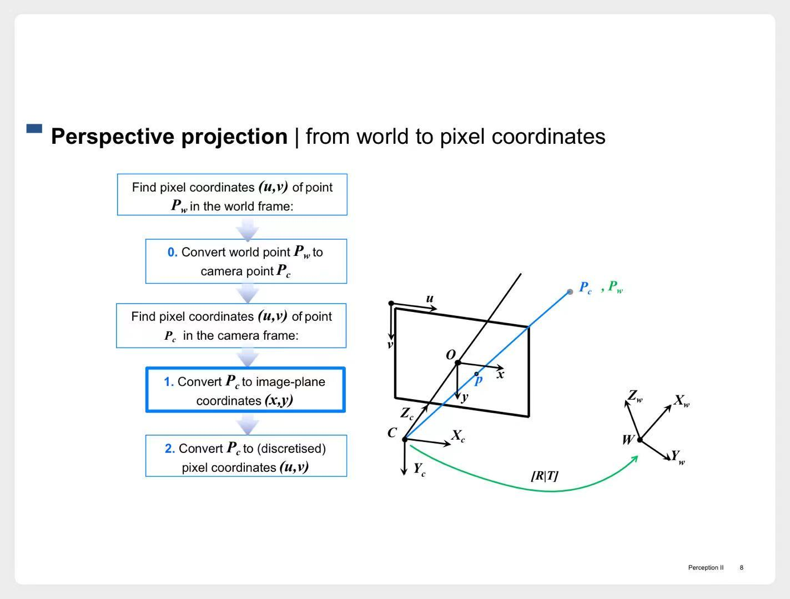

> 1. 真实世界中的三维坐标，某个点的坐标记为$P_w$
> 2. 相机的三维坐标，某个点的坐标记为$P_c$
> 3. 像平面中的二维坐标，某个点的坐标记为$P(x, y)$
> 4. 像平面中的图像，最终用像素表示。某个点的坐标记为$(u, v)$

## 1.2 相机内参（Intrinsic Parameters）

1. $P_c$ --> $(x,y)$

    

    
示意图

    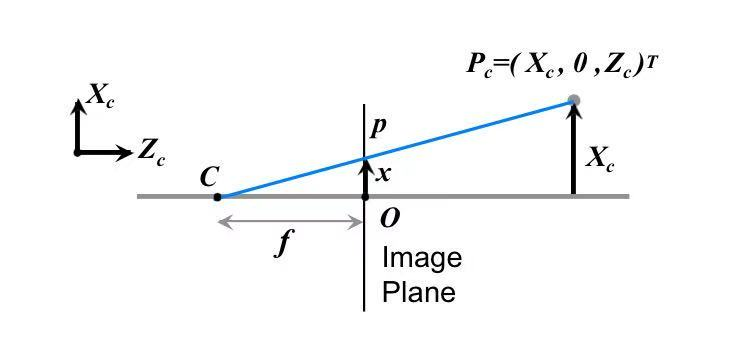

    

    $$
    \begin{cases}
    \frac x f = \frac {X_c} {Z_c} &\Rightarrow x = \frac {f X_c} {Z_c} \\
    \\
    \frac y f = \frac {Y_c} {Z_c} &\Rightarrow y = \frac {f Y_c} {Z_c}
    \end{cases}
    $$

2. $(x,y)$ --> $(u,v)$

    

    
示意图

    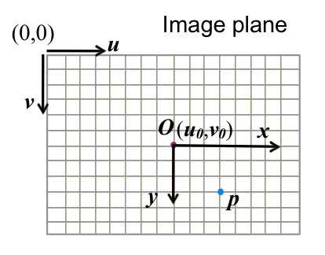

    

    - 引入两个变量$k_u、k_v$，分别代表u、v方向上的比例因子。  
    - 计算就很简单了：
    $$
    \begin{cases}
    u = u_0 + k_u x \\
    v = v_0 + k_v y
    \end{cases}
    $$

3.  $P_c$ --> $(x,y)$ --> $(u,v)$

    - 把这两步综合起来：
    $$
    \begin{cases}
    u = u_0 + \frac {k_u f X_c} {Z_c} \\
    \\
    v = v_0 + \frac {k_v f Y_c} {Z_c}
    \end{cases}
    $$

4. 写成矩阵形式：
    1. 先做一步变换
    $$
    \begin{cases}
    u = u_0 + \frac {k_u f X_c} {Z_c} &\Rightarrow u Z_c = u_0 Z_c + k_u f X_c \\
    \\
    v = v_0 + \frac {k_v f Y_c} {Z_c} &\Rightarrow v Z_c = v_0 Z_c + k_v f Y_c
    \end{cases}
    $$

    2. 对应的矩阵形式：
    $$
    \begin{aligned}
        \begin{bmatrix}
        u Z_c \\
        v Z_c
        \end{bmatrix}
        &= \begin{bmatrix}
        u Z_c \\
        v Z_c \\
        Z_c
        \end{bmatrix}
        = \lambda \begin{bmatrix}
        u \\
        v \\
        1
        \end{bmatrix} \\
        &= \begin{bmatrix}
        k_u f & 0 & u_0 \\
        0 & k_v f & v_0 \\
        0 & 0 & 1
        \end{bmatrix}
        \begin{bmatrix}
        X_c \\
        Y_c \\
        Z_c
        \end{bmatrix} \\
        &= K 
        \begin{bmatrix}
        X_c \\
        Y_c \\
        Z_c
        \end{bmatrix}
    \end{aligned}  
    $$

#### 总结

$K$矩阵将相机的三维坐标$P_c$转换成像素坐标$(u,v)$。  
$K$矩阵中的$k_u、k_v、f、u_0、v_0$在相机做好的时候，就已经确定了。  
所以这里的$K$矩阵，是相机的“**内参**”

## 1.3 相机外参

我们总可以将$P_w$所在到坐标系**旋转**、**平移**后，与 $P_c$ 所在到坐标系重合。  
所以$P_w、P_c$之间的坐标转换，也可以用矩阵来表示：

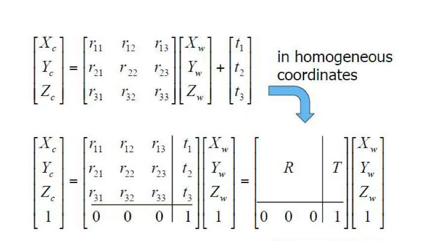

准备拍照时，相机的位姿确定好，$R、T$也就确定了。  
所以这里的$R、T$矩阵，是相机的“**外参**”

## 综合

最后综合起来，我们拍张照片  
就是将真实世界中的三维坐标$P_w$转换到像素坐标$(u,v)$

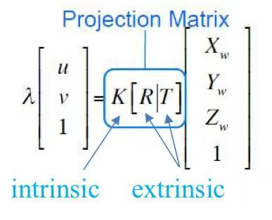

# 二、可能存在的问题

了解完拍照过程中涉及到哪些参数，接下来我们看看拍照过程中可能遇到哪些问题。

## 2.1 径向畸变

相机制作出来，不可能是完美的。  
透镜有问题，即$K$矩阵有问题，会导致拍摄出来的照片发生径向畸变。

示意图

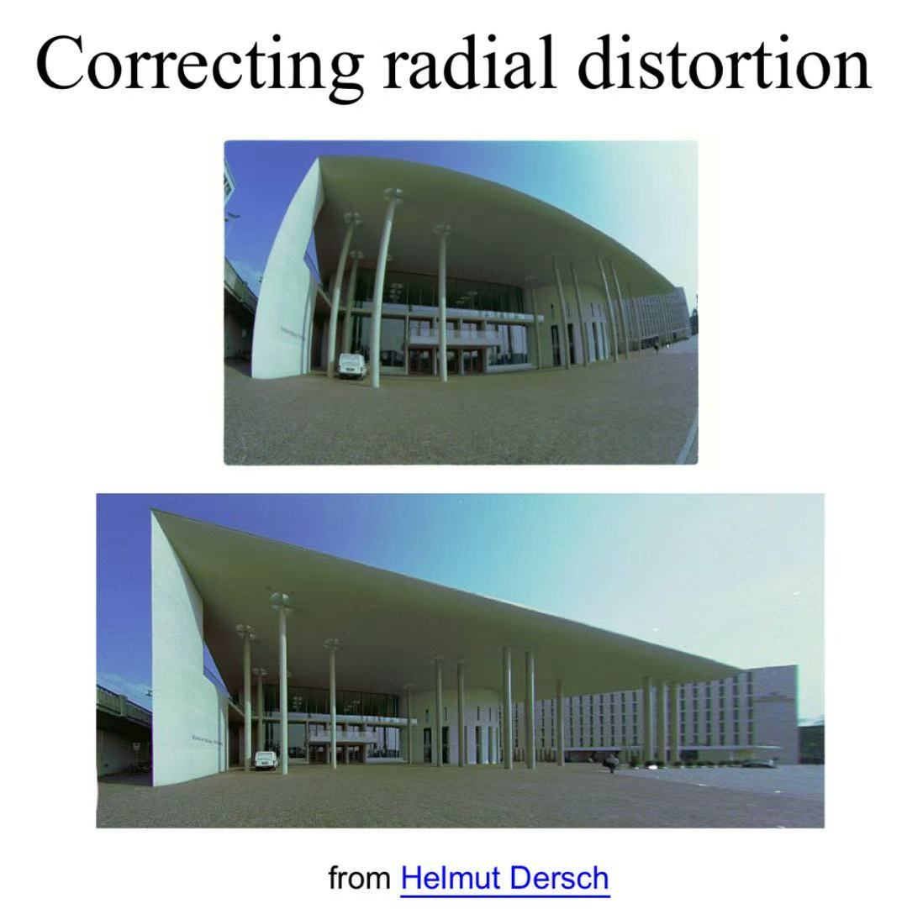

> 边缘部分扭曲更严重

拍摄出来的照片是可以修正回来的。

修正示意图

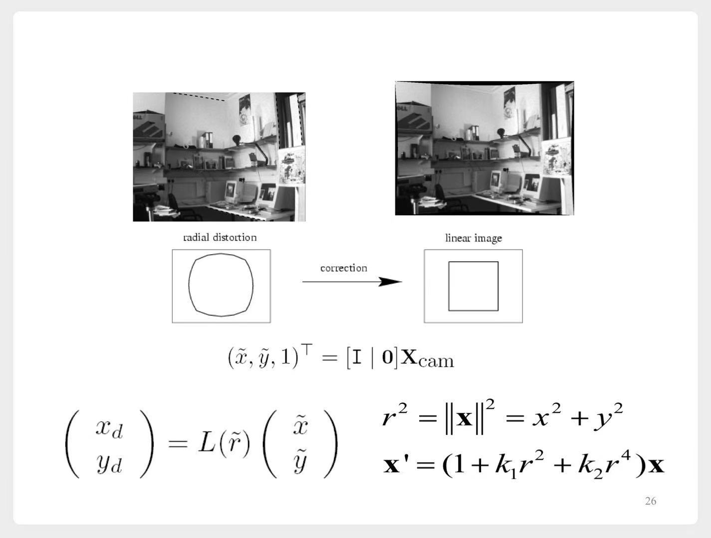

> 底下这堆公式没看懂~

## 2.2 透视畸变（perspective distortion）

位姿问题，即$R、T$矩阵有问题，会导致拍摄出来的照片发生透视畸变。

示意图

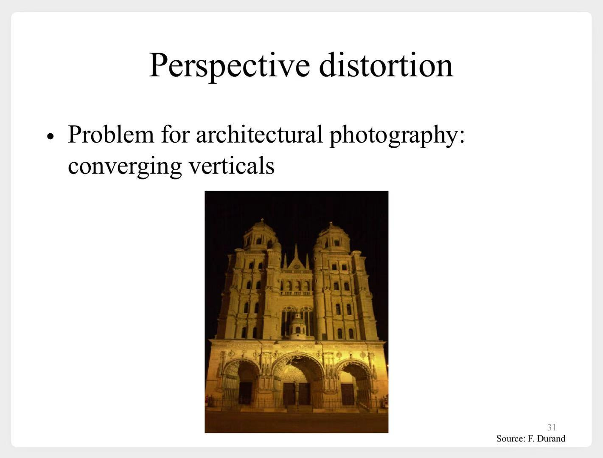

**修正**：可以通过各种高端相机来拍照

# 三、正交投影

理想效果，如果我们的$K[R|T]$矩阵是这样：
$$
K[R|T]
= \begin{bmatrix}
    1 & 0 & 0 & 0 \\
    0 & 1 & 0 & 0 \\
    0 & 0 & 0 & 1
\end{bmatrix}
$$

拍出来的照片就是**正交投影**的，只是将外部世界的图像等比例缩小（参数$\lambda$）放在图片中。

# 四、摄像机标定（校准）

通过校准，可以帮助我们反推出**内参**、**外参**。  
从而进行 修正图片、精确测量 等工作。

## 4.1 直接求解

1. 固定好相机的位姿，对这张图片拍照：

    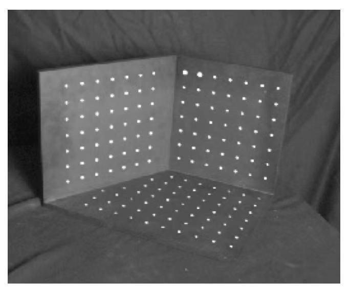

    - 这样的话，对于每个亮点，我们都知道相应的$P_w、(u,v)$

2. 令$P = K[R|T]$，现在我们就可以直接计算出$P$矩阵中的每个元素
    - 每对坐标，都可以建立这样的公式

        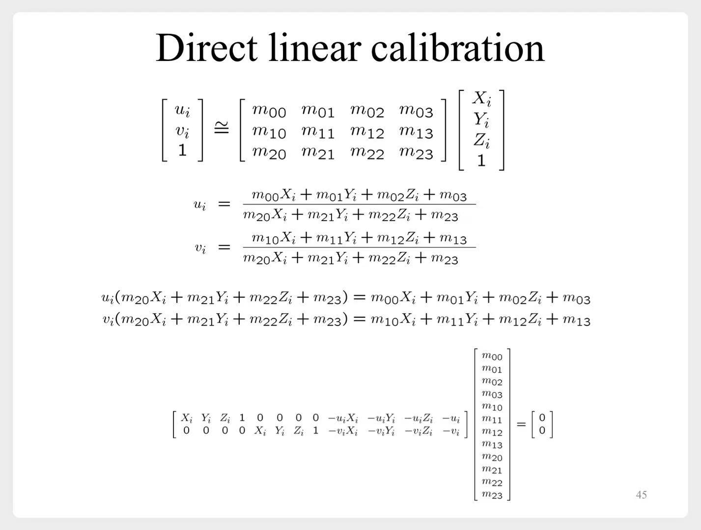
    - 6对坐标，联立求解

#### 这样做方便快捷，但是还有一些问题：

1. 直接计算出$K[R|T]$，位姿确定的情况下，可以得到矩阵$K$，得不到具体参数信息$k_u、k_v、f$
2. 无法利用已知信息
    - 例如我们已经知道了透镜的焦距$f$
3. 没有利用几何误差

## 4.2 利用几何误差来计算

类似于我们之前学习**特征对应**时**RANSAC**，可以通过最小化平方误差，来找$P$矩阵的最优解。

通常的**实践方案**是：
1. 直接求解，先得到$P$矩阵的初始值
2. 最小化平方误差，迭代寻找最优解

## 4.3 多平面校准

最后简单介绍了下，还有一种替代方案，多平面校准。有这些优势：
1. 只需要一个平面
2. 不需要确定位姿
3. 代码开源
4. 可计算出相机**内参**、**外参**

# 五、消失线、点

1. **消失点**：现实中的两条平行线，在拍出来的照片中会变得不平行，它们最终会相交于某一点。

示意图

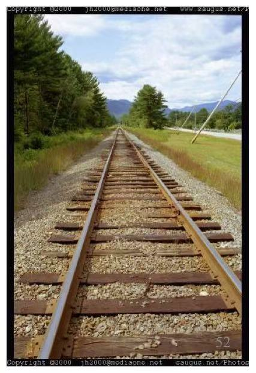

2. **消失线**：在一个平面中，一组平行线有一个**消失点**，多组平行线，就会有多个**消失点**。并且它们在一条直线上。

示意图

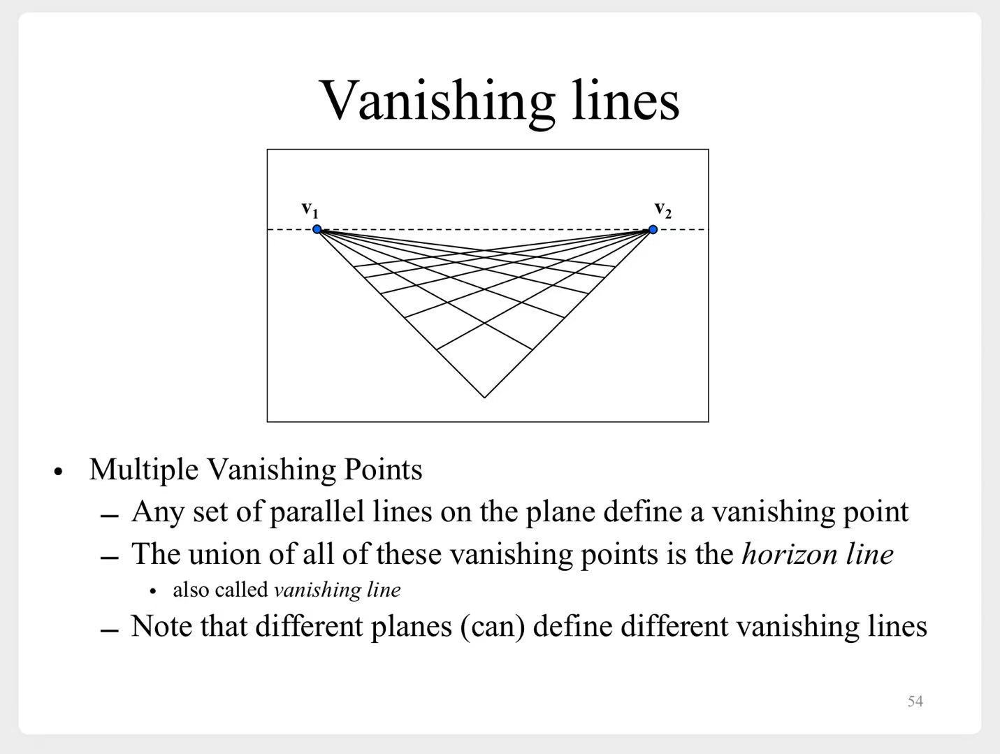

