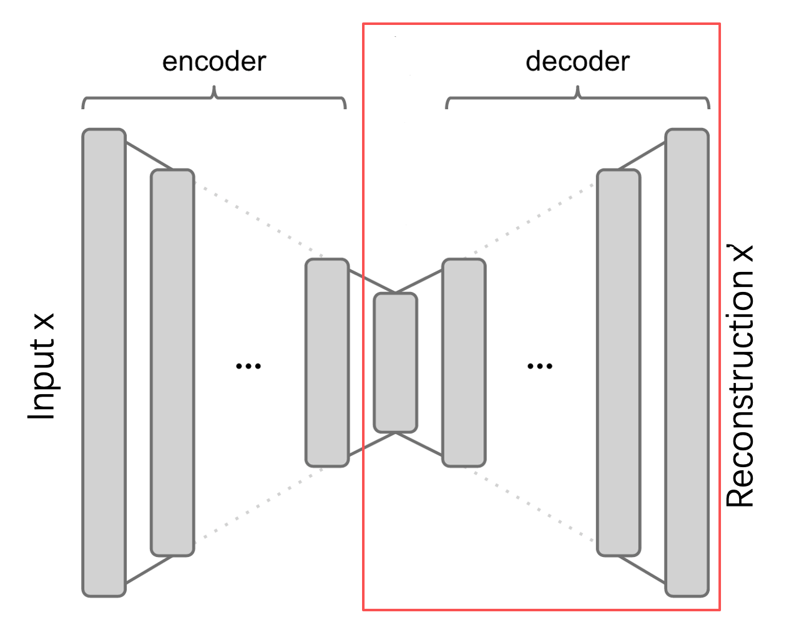
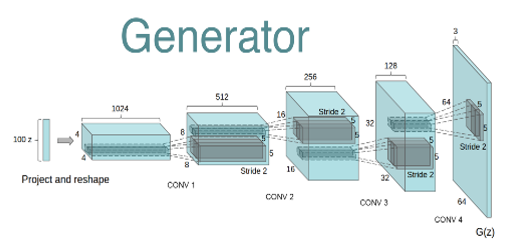
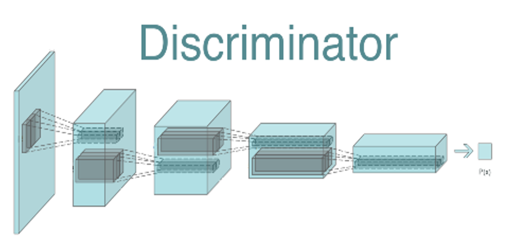
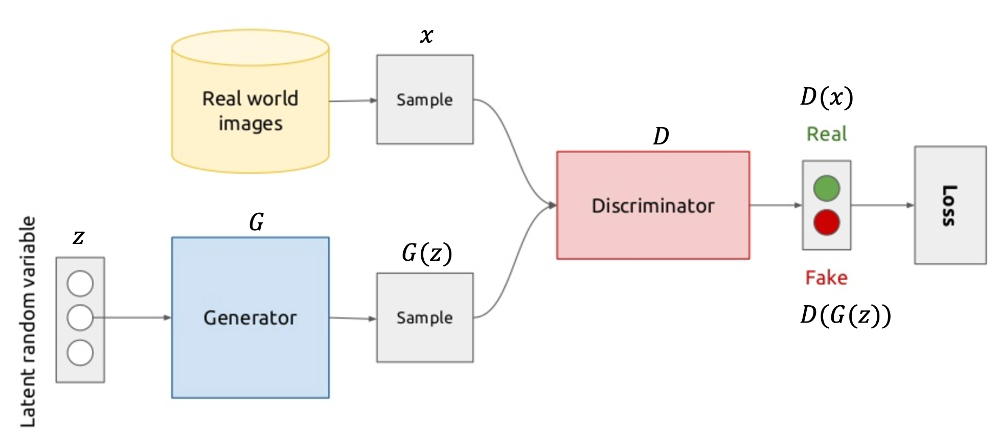
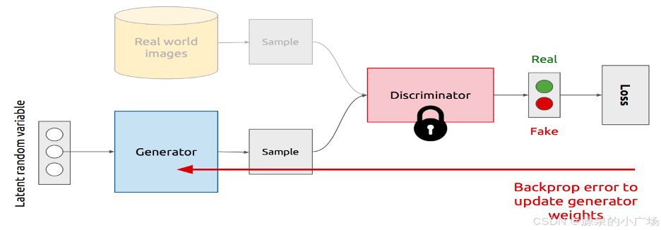
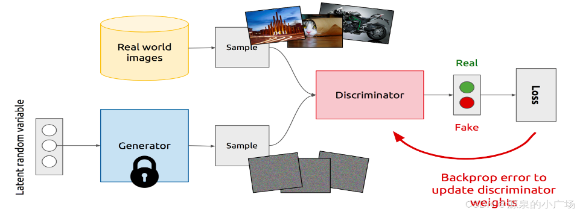

# GAN网络

# 一、回顾

> 正好**缪老师**[生成式模型](人工智能原理/学习/生成式模型.md)这堂课介绍了：  
> **生成式模型**、**AE**、**VAE**

# 二、GAN网络

## 2.1 生成器

使用**VAE**中的`decoder`来做生成器

示意图

> 另一个视角：

## 2.2 判别器

使用**CNN网络**来做一个简单的分类模型，预测图像的真假。

示意图

## 2.3 整体架构

## 2.4 训练流程

#### 1) 生成器的训练

> 固定判别器，只训练生成器。  
> 损失函数为：
> $$
> J_G = - \frac 1 m \sum\limits_{i=1}^m \log D(G(z_i))
> $$
> $D(G(z_i))$越接近1越好

#### 2) 判别器的训练

> 固定生成器，只训练判别器。  
> 损失函数为：
> $$
> J_D = - \frac 1 m \sum\limits_{i=1}^m \log D(x_i) - \frac 1 m \sum\limits_{i=1}^m \log (1-D(G(z_i)))
> $$
> $D(x_i)$越接近1越好  
> $D(G(z_i))$越接近0越好

## 2.5 GAN的全局最优解

当且仅当$P_{gene} = P_{data}$时，存在最优解，即达到**纳什均衡**：  
此时生成模型G恢复了训练数据的分布，  
判别模型D的准确率等于50%。

> 但是GAN网络非常难训，收敛是很困难的...