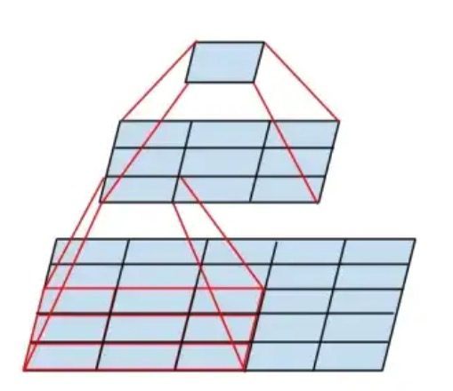
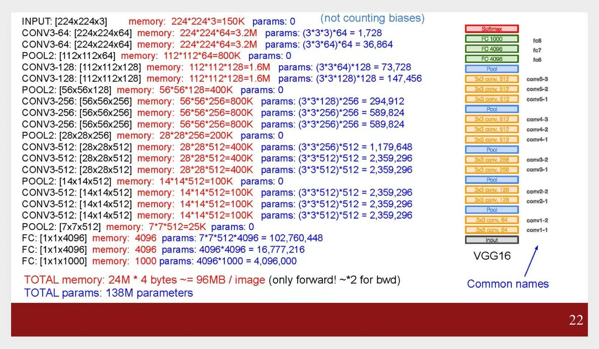
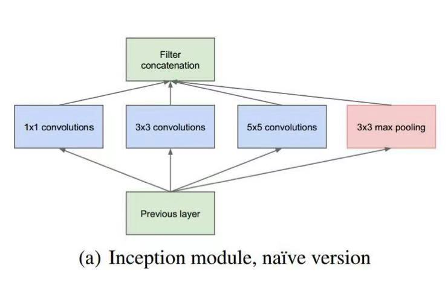
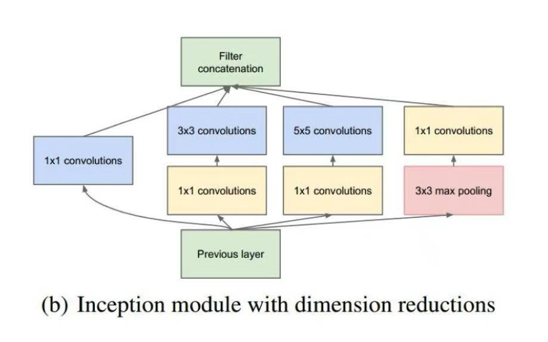
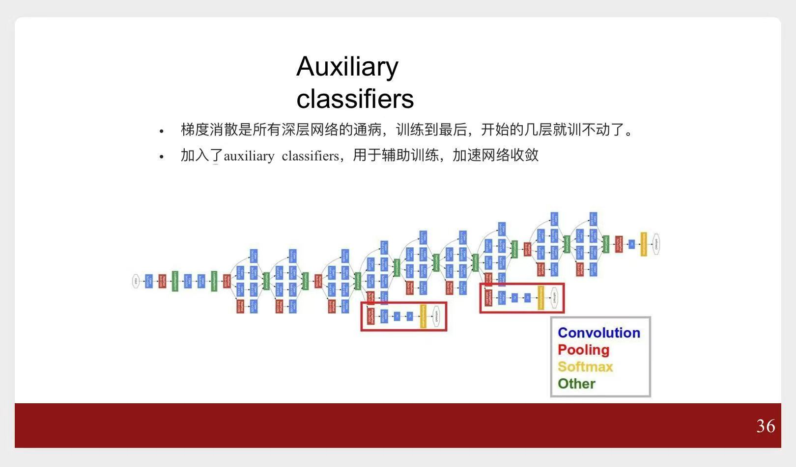
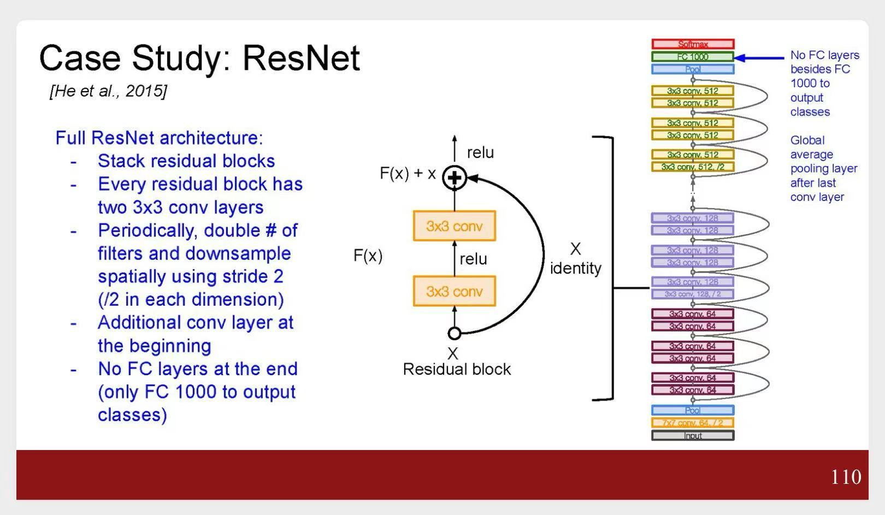

# 典型CNN结构

# 一、AlexNet

> [模式识别与机器学习](模式识别与机器学习/)、[人工智能原理](人工智能原理/)课程中，都详细介绍了**LeNet**  
> 有了之前的基础，也可以详细分析一下**AlexNet**的结构、参数量等  
> ~~这里略~~

# 二、ZFNet

在**AlexNet**基础上，调整了一些超参：
1. **CONV1**: 修改卷积核大小，`11x11` --> `7x7`
2. **CONV3,4,5**: 提升通道数量

# 三、VGGNet

## 3.1 采用堆积的小卷积核

#### 1) 感受野

2个`3x3`的卷积核堆积，感受野相当于1个`5x5`的卷积核  
3个`3x3`的卷积核堆积，感受野相当于1个`7x7`的卷积核

示意图

#### 2) 参数量

假设输入、输出通道数均为$C$
||非线性|参数量|连接数/计算量|
|---|---|---|---|
|1层`7x7`|1次ReLU|C x`7x7xC`=$49C^2$|参数量 x 输出层神经元个数|
|3层`3x3`堆积|3次ReLU|**3 x** (C x`3x3xC`) = $27C^2$|参数量 x 输出层神经元个数|

## 3.2 VGG16的参数量、显存占用

示意图

---

# 四、GoogLeNet

## 4.1 inception块

version1

> 假设上一层的输出为`28x28x256`
|结构|shape|参数量(忽略bias)|连接数/计算量|
|---|---|---|---|
|128个`1x1x256`|(28,28,256) --> (28,28,128)|128 x`1x1x256`|参数量 x`28x28`|
|192个`3x3x256`|(28,28,256) --> (28,28,192)|192 x`3x3x256`|参数量 x`28x28`|
|96个`5x5x256`|(28,28,256) --> (28,28,96)|96 x`5x5x256`|参数量 x`28x28`|
|汇总|||854M|

version2

> 假设上一层的输出为`28x28x256`
|结构|shape|参数量(忽略bias)|连接数/计算量|
|---|---|---|---|
|128个`1x1x256`|(28,28,256) --> (28,28,128)|128 x`1x1x256`|参数量 x`28x28`|
|64个`1x1x256` 192个`3x3x64`|(28,28,256) --> (28,28,64) --> (28,28,192)|64 x`1x1x256` +192 x`3x3x64`|参数量 x`28x28`|
|64个`1x1x256` 96个`5x5x64`|(28,28,256) --> (28,28,64) --> (28,28,96)|64 x`1x1x256` +96 x`5x5x64`|参数量 x`28x28`|
|64个`1x1x256`|(28,28,256) --> (28,28,64)|64 x`1x1x256`|参数量 x`28x28`|
|汇总|||358M|

> 在通道纬度上，先降维再升维。  
> 从而减少参数量

## 4.2 auxiliary classifiers

示意图

## 4.3 思考

**GoogLeNet**解决了什么问题呢？

1. 随着网络层数加深，规模变大，参数增多，计算量也增高。
    - **GoogLeNet**精心设计了**inception块**
    - 尽管层数加深，但是有效控制`通道数`，从而减少参数量、计算量
2. 网络越深，越容易梯度消失
    - 引入两个**辅助分类网络**

# 五、ResNet

# 六、SENet

> **核心思想**  
> 为每个通道，分配不同的权重

# 最后、 一点儿思考

> 刚开始接触`CNN`的时候，一直有个困惑：  
> 如何选择合适的卷积核尺寸？  
> 为什么是`3x3`、`5x5`？

这里列出一系列`CNN网络`的第一层卷积核
|模型|第一层卷积核|思考|
|---|---|---|
|LeNet|`5x5`|`手写数字识别`，图片大小为`32x32`， 此时精心设计，用`5x5`来提取浅层特征|
|AlexNet|`11x11`|`ILSVRC`，图片大小为`224x224`， 卷积核尺寸也相应增加|
|ZFNet|`7x7`|在AlexNet基础上调整超参，发现`7x7`效果更好|
|GoogLeNet|`7x7`||
|VGG|两个`3x3`堆积，相当于`5x5`|采用堆积的小卷积核|
|ResNet|`7x7`||

#### 结论

第一层可以尝试`7x7`、`5x5`等，  
后面的层，n个`3x3`堆积。已成为现在的主流。