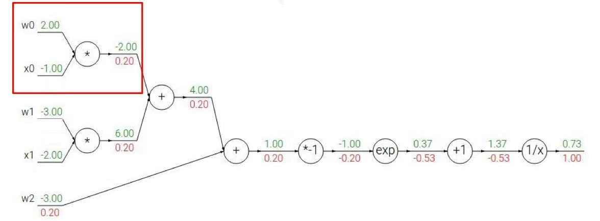
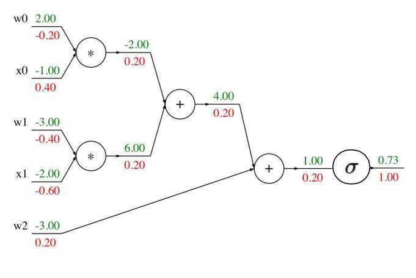
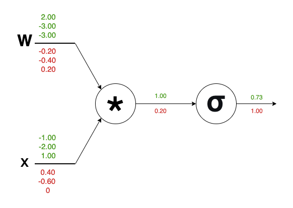

# 反向传播

- 三位老师都介绍了**反向传播**  
    - 多刷几遍，慢慢就懂了～  
- 推荐b站一个视频：[斯坦福的CS224n](https://www.bilibili.com/video/BV1ox411E7Qe/?spm_id_from=333.1391.0.0&p=5&vd_source=6f83dfd98e9e60e0535ab4b15f5c8e50)
    - 2017年的课程，**Richard**从3个角度介绍了反向传播
    - [计算机视觉](计算机视觉/)课程，从第2个角度讲解的
    - [人工智能原理](人工智能原理/)课程，从第3个角度讲解的

> 2018年的CS224n就没有这部分内容了。  
> 八卦了一下，原来**Richard**17年从斯坦福离职了

---

# 一、图解

#### 1) $f(w,x) = \frac 1 {1+e^{-(w_0x_0+w_1x_1+w_2)}}$



#### 2) $f(w,x) = \sigma (w_0x_0+w_1x_1+w_2)$



#### 3) $f(w,x) = \sigma (wx)$



> 一步步简化，最后一版更符合我们的代码  
> 为了让我们理解这一版（向量、矩阵也可以直接画在流程图中）  
> 老师还耐心解释了一下**雅可比矩阵**

---

# 二、矩阵乘法的求导

1. 前向计算
    $$
    \begin{aligned}
        \begin{pmatrix}
            y^{(1)}_{1} & y^{(1)}_{2} & \cdots & y^{(1)}_{n}\\
            y^{(2)}_{1} & y^{(2)}_{2} & \cdots & y^{(2)}_{n}\\
            \vdots & \vdots & \ddots & \vdots\\
            y^{(k)}_{1} & y^{(k)}_{2} & \cdots & y^{(k)}_{n}\\
        \end{pmatrix}
        = 
        \begin{pmatrix}
            x^{(1)}_{1} & x^{(1)}_{2} & \cdots & x^{(1)}_{m}\\
            x^{(2)}_{1} & x^{(2)}_{2} & \cdots & x^{(2)}_{m}\\
            \vdots & \vdots & \ddots & \vdots\\
            x^{(k)}_{1} & x^{(k)}_{2} & \cdots & x^{(k)}_{m}\\
        \end{pmatrix}
        \begin{pmatrix}
            w_{11} & w_{12} & \cdots & w_{1n}\\
            w_{21} & w_{22} & \cdots & w_{2n}\\
            \vdots & \vdots & \ddots & \vdots\\
            w_{m1} & w_{m2} & \cdots & w_{mn}
        \end{pmatrix}
    \end{aligned}
    $$

2. 反向传播时，给出$dy$，需要我们计算$dw、dx$
    $$
    \begin{aligned}
        \begin{pmatrix}
            dw_{11} & dw_{12} & \cdots & dw_{1n}\\
            dw_{21} & dw_{22} & \cdots & dw_{2n}\\
            \vdots & \vdots & \ddots & \vdots\\
            dw_{m1} & dw_{m2} & \cdots & dw_{mn}
        \end{pmatrix}
        =
        \begin{pmatrix}
            x^{(1)}_{1} & x^{(2)}_{1} & \cdots & x^{(k)}_{1}\\
            x^{(1)}_{2} & x^{(2)}_{2} & \cdots & x^{(k)}_{2}\\
            \vdots & \vdots & \ddots & \vdots\\
            x^{(1)}_{m} & x^{(2)}_{m} & \cdots & x^{(k)}_{m}\\
        \end{pmatrix}
        \begin{pmatrix}
            dy^{(1)}_{1} & dy^{(1)}_{2} & \cdots & dy^{(1)}_{n}\\
            dy^{(2)}_{1} & dy^{(2)}_{2} & \cdots & dy^{(2)}_{n}\\
            \vdots & \vdots & \ddots & \vdots\\
            dy^{(k)}_{1} & dy^{(k)}_{2} & \cdots & dy^{(k)}_{n}\\
        \end{pmatrix}  \\
        \begin{pmatrix}
            dx^{(1)}_{1} & dx^{(1)}_{2} & \cdots & dx^{(1)}_{m}\\
            dx^{(2)}_{1} & dx^{(2)}_{2} & \cdots & dx^{(2)}_{m}\\
            \vdots & \vdots & \ddots & \vdots\\
            dx^{(k)}_{1} & dx^{(k)}_{2} & \cdots & dx^{(k)}_{m}\\
        \end{pmatrix}
        =
        \begin{pmatrix}
            dy^{(1)}_{1} & dy^{(1)}_{2} & \cdots & dy^{(1)}_{n}\\
            dy^{(2)}_{1} & dy^{(2)}_{2} & \cdots & dy^{(2)}_{n}\\
            \vdots & \vdots & \ddots & \vdots\\
            dy^{(k)}_{1} & dy^{(k)}_{2} & \cdots & dy^{(k)}_{n}\\
        \end{pmatrix}
        \begin{pmatrix}
            w_{11} & w_{21} & \cdots & w_{m1}\\
            w_{12} & w_{22} & \cdots & w_{m2}\\
            \vdots & \vdots & \ddots & \vdots\\
            w_{1n} & w_{2n} & \cdots & w_{mn}
        \end{pmatrix}
    \end{aligned}
    $$

- 简练一点，写成矩阵形式就是:
    $$
        Y = XW \Longrightarrow 
        \begin{cases}
        dW = X^T dY \\
        dX = dY W^T
        \end{cases}
    $$
- 写出对应的代码
    ```python
    # 正向传播
    Y = np.dot(X, W)

    # 反向传播
    dw = np.dot(X.T, dy)
    dx = np.dot(dy, W.T)
    ```
