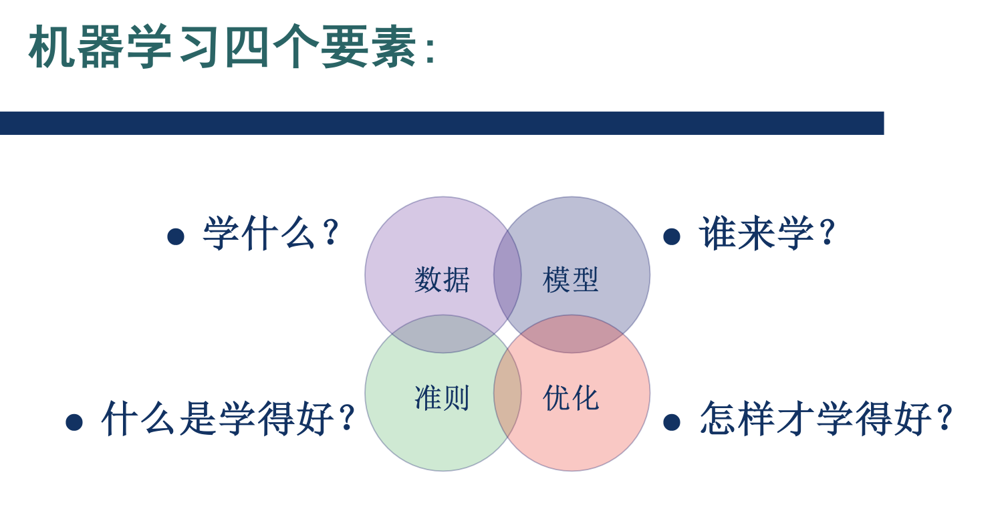
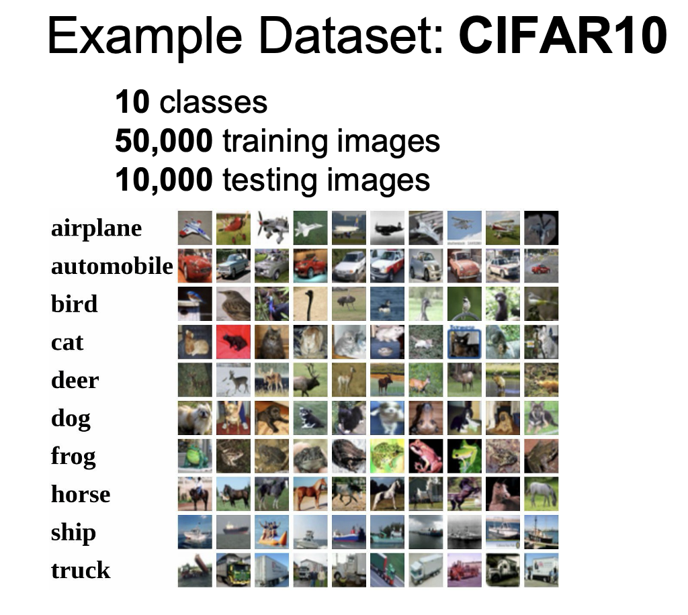
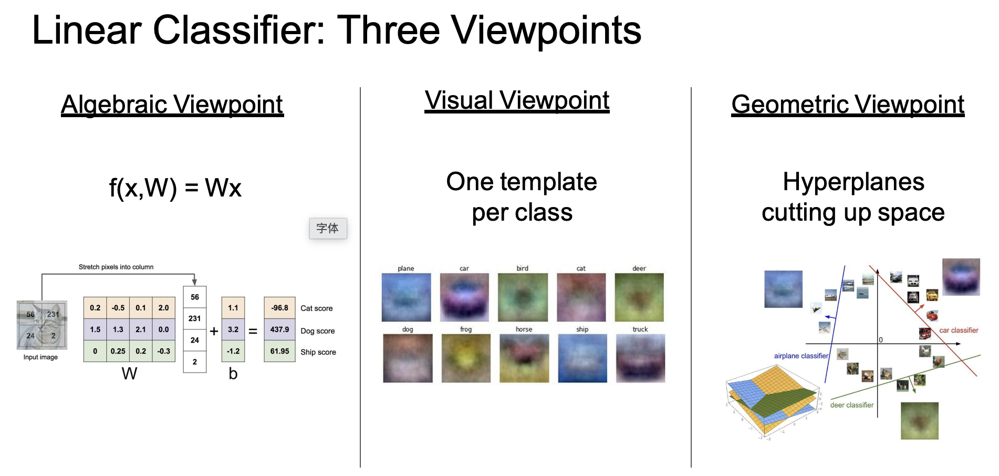

# 图像分类

> 这节课比较简单，简单记录一下课程内容。  
> 借用**缪老师**的一张图：
> 
> 

# 一、数据集

<b>CIFAR10</b>

---

# 二、模型

介绍了两个模型：

1. [KNN](模式识别与机器学习/监督学习/KNN.md)
2. 线性模型

    

    
从三个角度来理解线性模型

    

    

---

# 三、损失函数

介绍了两个常见的损失函数：

1. Multiclass SVM loss
    $$
    \begin{aligned}
    L_i &= \sum\limits_{j \neq y_i}
        \begin{cases}
        0 & if \quad s_{y_i} \ge s_j + 1 （分类的足够好时，损失为0）\\
        s_j - s_{y_i} + 1 & otherwise
        \end{cases} \\
    &= \sum\limits_{j \neq y_i} \max (0, s_j - s_{y_i} + 1)
    \end{aligned}
    $$
2. 交叉熵损失函数

---

# 四、优化算法

梯度下降法
