# 目标检测与分割

# 一、语义分割

> 给图片中每个像素分类
> 

> 
示意图

>
> 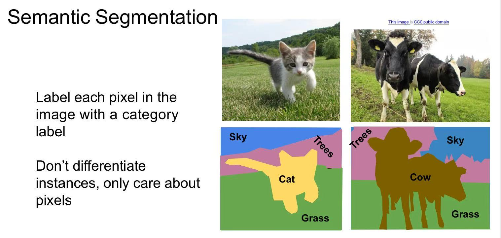
>
> 

## 1.1 简单方案

1. 使用n个卷积层来提取特征，每个特征图的长宽均为`HxW`
2. 最后一层，则相当于`HxW`个分类器，为每个像素分类

示意图

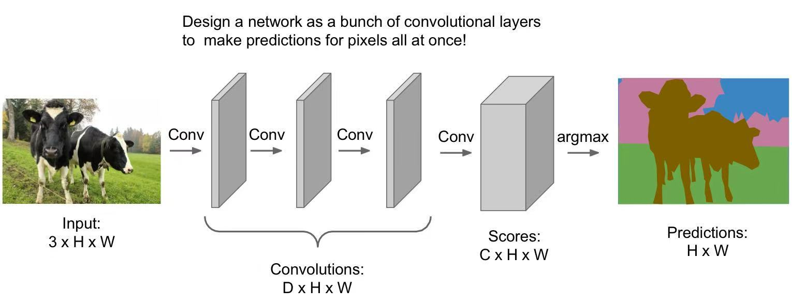

## 1.2 FCN

> 第一种方案，每次特征图均为`HxW`，计算量太大。  
> FCN做了一些简化：
>    - 先通过**卷积层**做`downsampling`，特征图逐渐减小
>    - 再通过**转置卷积**做`upsampling`，特征图逐渐还原

示意图

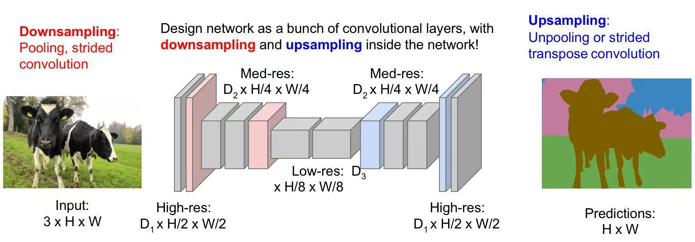

### upsampling

#### 1) pool层的`upsampling`

方式1

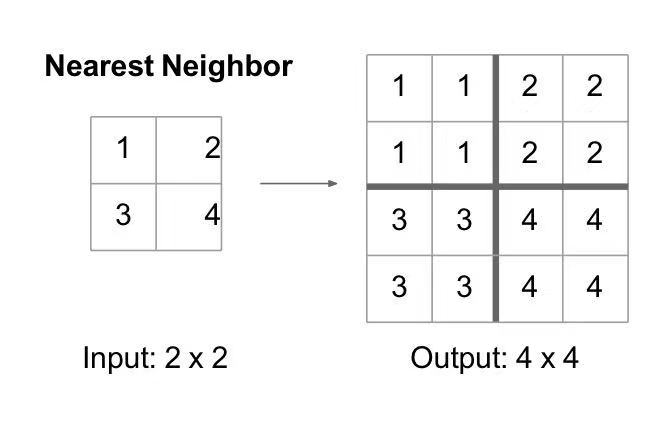

方式2

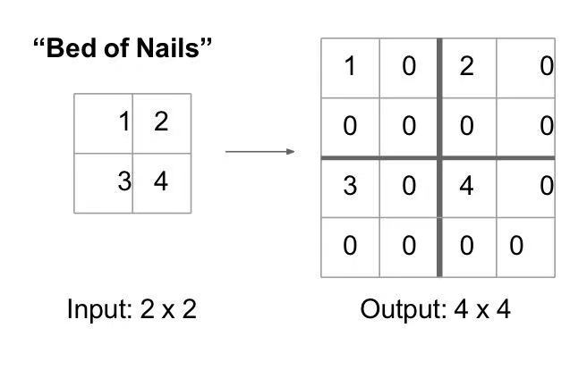

方式3

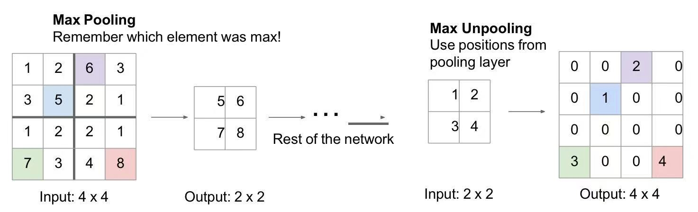

#### 2) conv层的`upsampling`

> 感觉还是**缪老师**[卷积神经网络](人工智能原理/学习/卷积神经网络.md)这堂课介绍的**转置卷积**更清楚一些，  
> 跟`torch.nn.ConvTranspose2d`一致。

# 二、目标检测

## 2.1 单目标检测

示意图

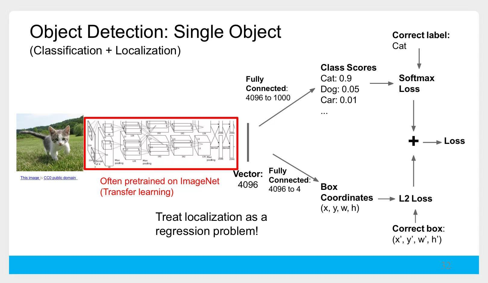
> 多任务学习
>    1. 分类任务：预测类别
>    2. 回归任务：预测框的坐标

## 2.2 多目标检测

### 2.2.1 R-CNN系列

#### 1) R-CNN

1. 使用**选择性搜索算法**选择2000个大小、形状不一的`候选区域`
2. 对每个`候选区域`变形，统一形状
3. 变形后的`候选区域`，去做**单目标检测**

示意图

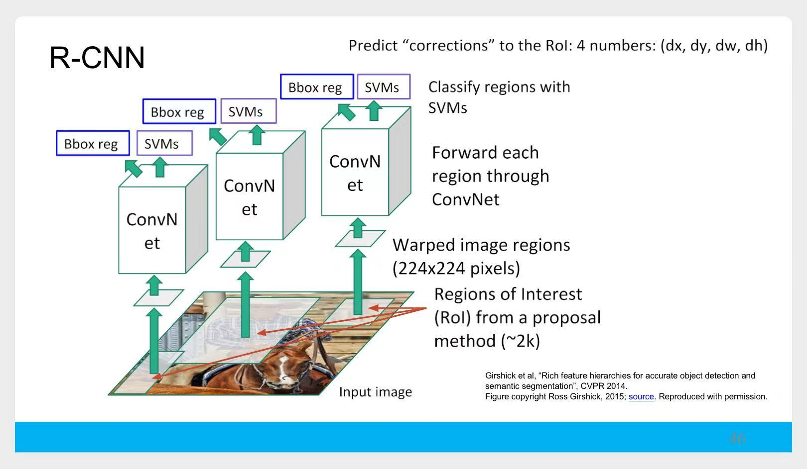

#### 2) Fast R-CNN

> **R-CNN**中，2000个`候选区域`均需要经过神经网络，很耗时。  
> 如何改进呢？

1. 使用**选择性搜索算法**选择2000个大小、形状不一的`候选区域`
2. 整张图片，经过神经网络，得到**特征图**
3. 将每个`候选区域`投影到**特征图**（示意图中的**RoI**）
    - 由于CNN的**平移不变性**，从原始图像到特征图，`候选区域`的相对位置保持固定。
4. 再经过神经网络，去做多任务学习

示意图

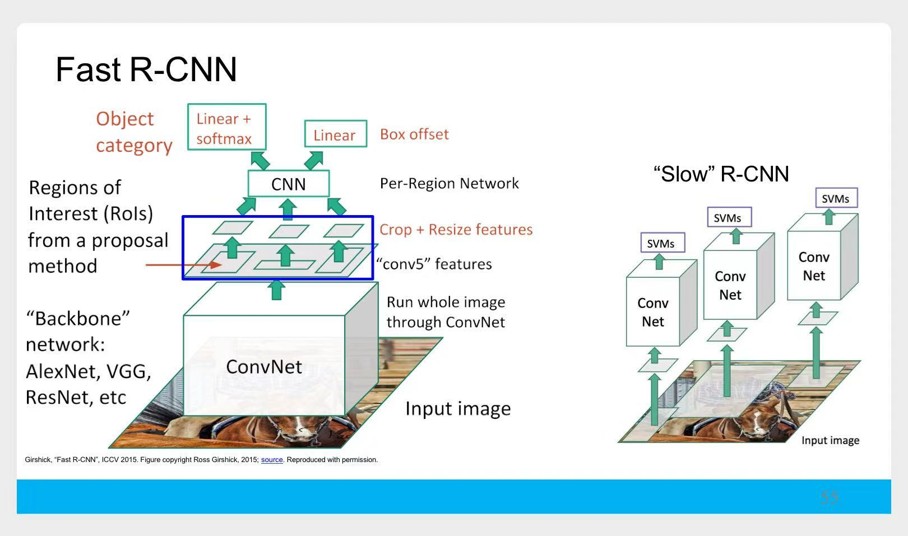

#### 3) Faster R-CNN

> **R-CNN**、**Fast R-CNN**都使用**选择性搜索算法**来生成`候选区域`，  
> **Faster R-CNN**将这部分工作也交给了神经网络。--- **区域提议网络**

示意图

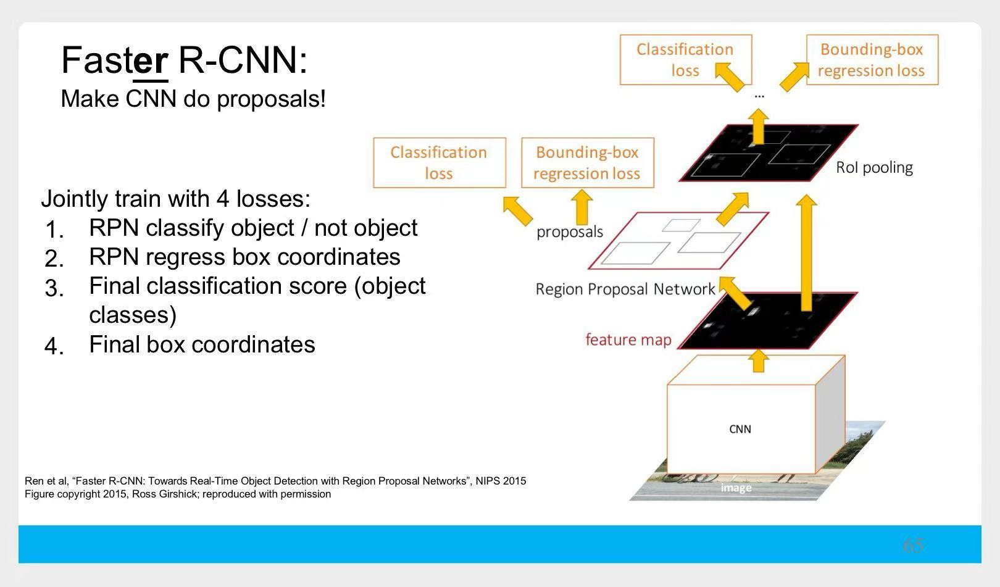

#### 总结

R-CNN系列

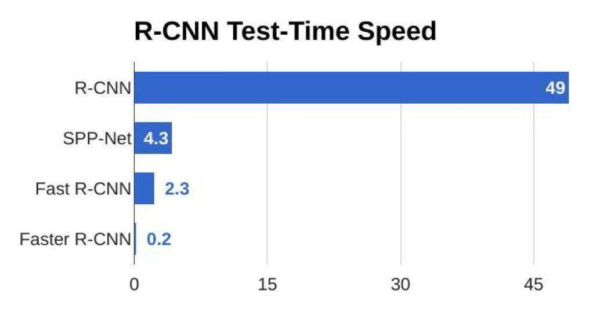
> 1. **R-CNN**预测一张图片耗时`49s`
> 2. 此时，2000次神经网络的前向计算占主要时间，于是诞生了**Fast R-CNN**，耗时降到`2.3s`
> 3. 此时，**选择性搜索算法**占主要时间，于是诞生了**Faster_R-CNN**，耗时降到`0.2s`

### 2.2.2 单阶段目标检测

> 简单提了一下，略

# 三、实例分割

## Mask R-CNN

> 在**Faster_R-CNN**基础上，又添加了一个`掩码预测`任务，  
> 对于每个**RoI**，使用一个小型的**FCN**来做像素级别的预测。

示意图

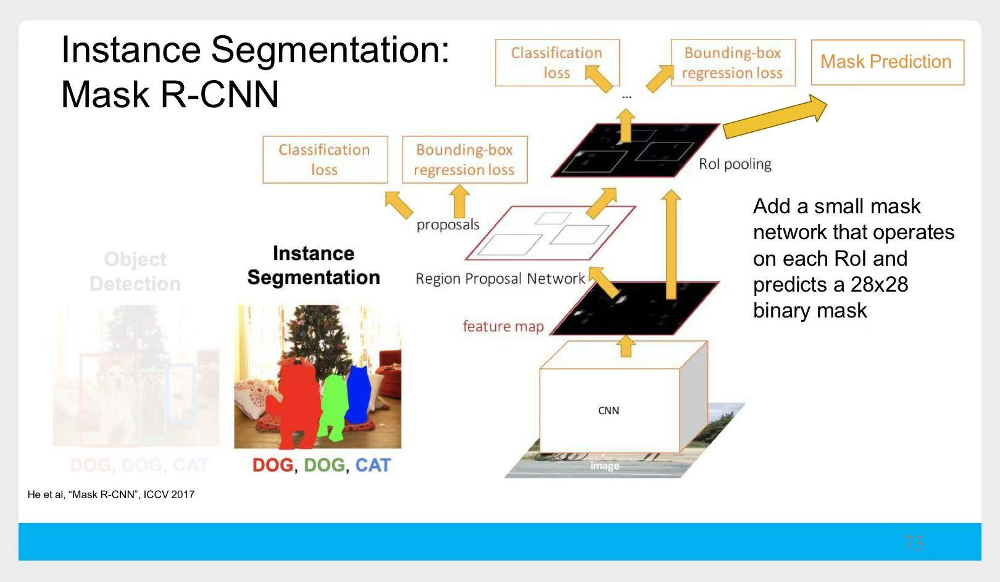

