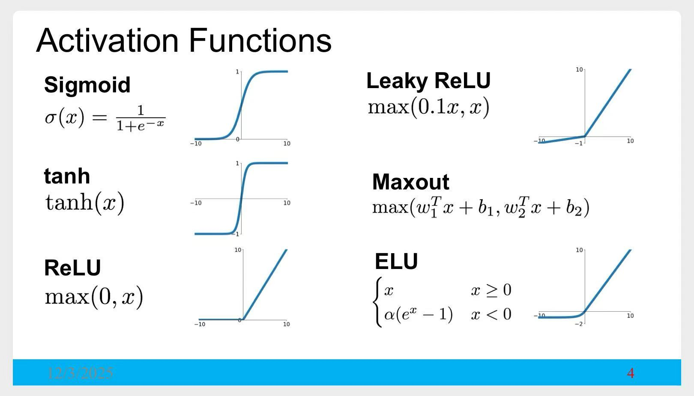
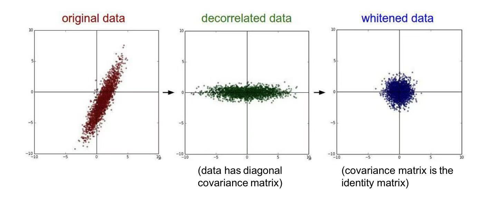
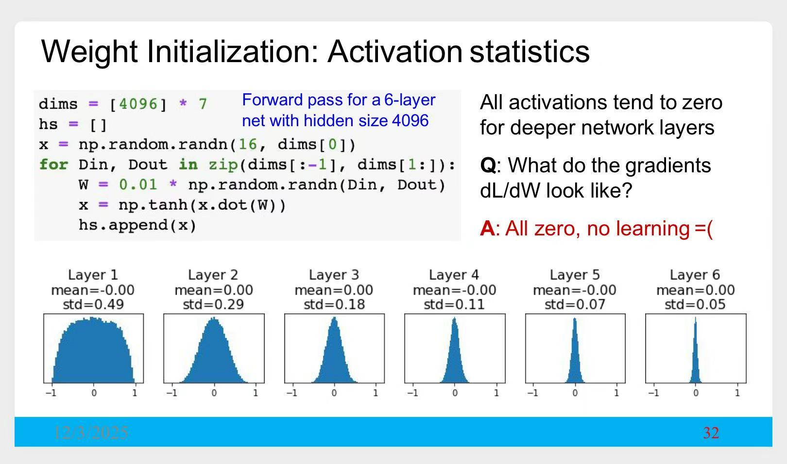
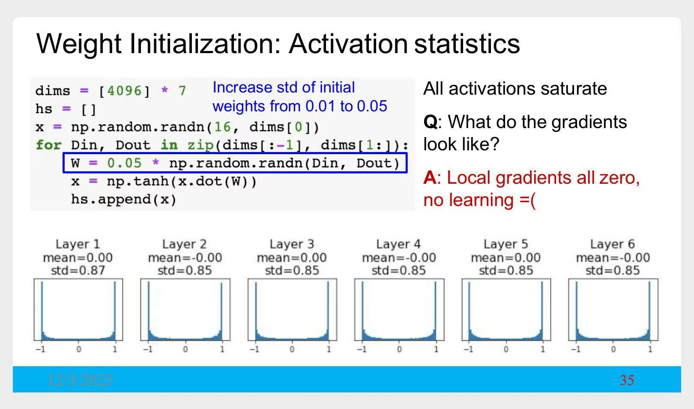
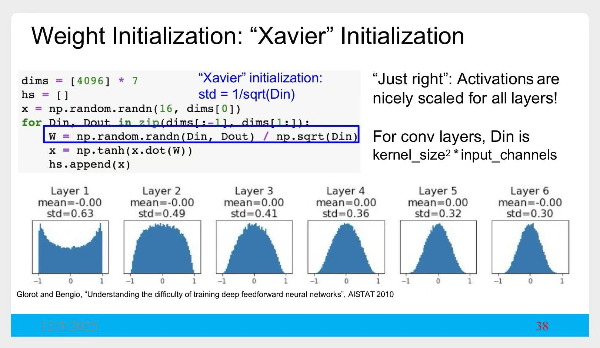
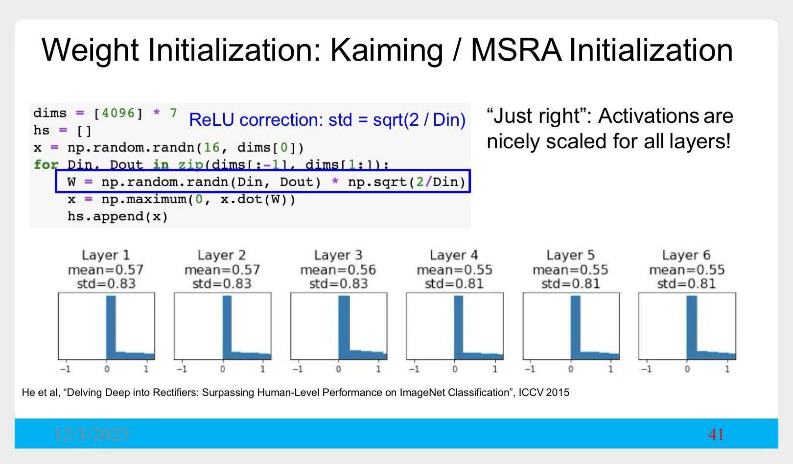
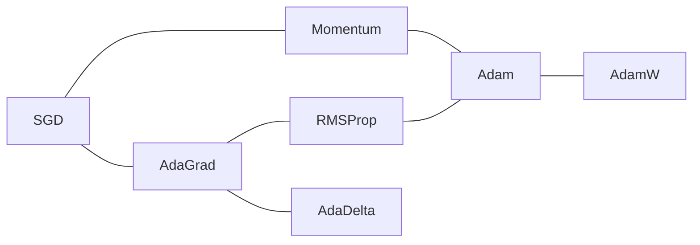
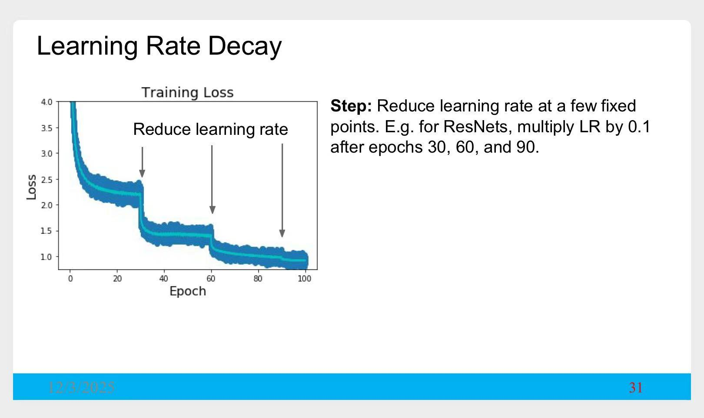
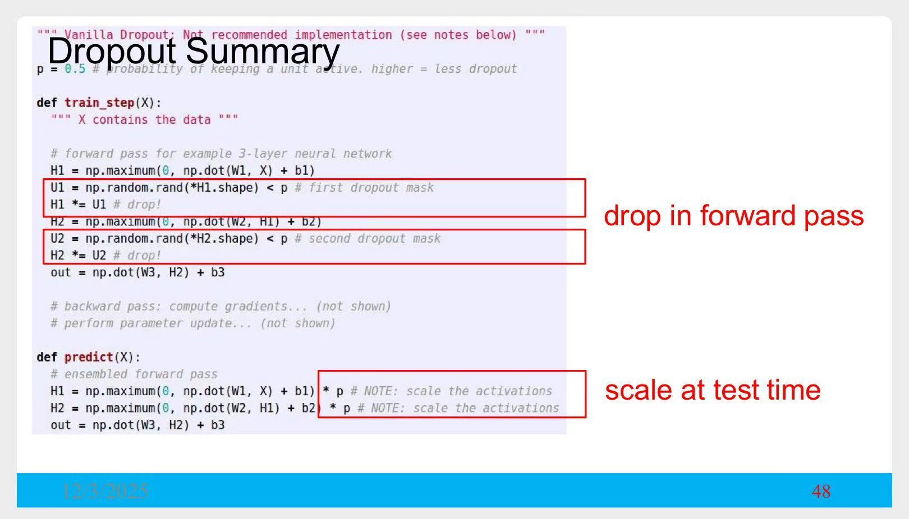
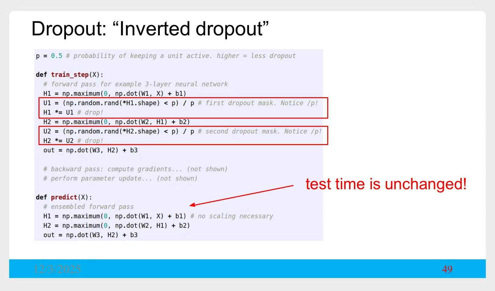

# 训练神经网络

# 一、激活函数

> 详细介绍了这几种激活函数。

# 二、数据预处理

1. 标准化：$X_{std} = \frac {X - \mu} \sigma$

    

    
可视化，加深理解

    
    

    

2. PCA + Whitening

    

    
可视化

    
    

    

- 示例
|模型|预处理|计算范围|
|---|---|---|
|AlexNet|$X = X - \mu$|$\mu$是在整张图片上，求均值|
|VGG|$X = X - \mu$|$\mu$是在每个通道，求均值|
|ResNet|$X_{std} = \frac {X - \mu} \sigma$|每个通道|

# 三、权重初始化

1. 随机初始化为很小的权重

    

    
1. 标准差为0.01的正态分布

    
    
    > 随着层数加深，激活值`a`越来越集中在`0`附近。  
    > 使用激活值`a`计算下一层的输入：$z = a W$  
    > 此时，$\frac {\partial z} {\partial W} = a$，几乎为0

    

    

    
2. 标准差为0.05的正态分布

    
    
    > 这里激活函数使用的`tanh`，激活值`a`集中在`-1`、`1`。  
    > 即$a = tanh(z)$集中在`-1`、`1`  
    > 此时，$\frac {\partial a} {\partial z} = tanh'(z)$几乎为0

    

2. Xavier初始化
    - 激活函数为`tanh`时，建议使用。
    - 根据输入单元的个数来计算方差

        

        
示意图

        
        

        

3. Kaiming初始化
    - 何恺明老师等人的研究
    - 激活函数为`ReLU`时，建议使用。

        

        
示意图

        
        

        

# 四、Batch Norm

> 上面介绍的**权重初始化**，  
> 就是为了让激活值`a`（即下一层的输入值）尽量满足标准正态  
 
**Batch Norm**的做法更直接，直接去调整这个输入值。  
使用了**Batch Norm**，对初始化要求就没那么高了。

# 五、优化算法

> 详细介绍了几种优化算法  
> 再搬一下这张图：

# 六、学习率调度

例：ResNet中，学习率的衰减

> 没认真听，只有个概念。  
> 看论文时，遇到`Warmup`、`lr_scheduler`知道在说什么...

# 七、正则

## 7.1 权重衰减

$L_1、L_2$ 正则

## 7.2 Dropout

版本1

版本2

## 7.3 一种通用模式

> 由此引出了一种更通用的**正则**方法：
> 1. 训练阶段，引入`随机性`
> 2. 测试阶段，求期望，消除`随机性`

列举了几个方案：
1. 数据增广
2. DropConnect
    - Dropout随机去除`隐藏单元`，DropConnect随机去除`连接`
3. Stochastic Depth
    - 随机去除好几层
4. 随机去除图像中的一部分

# 八、合理性检查

## 8.1 检查loss

例如准备了一个模型，对**CIFAR-10**进行分类。  
刚开始训练的前几个step，还没有学到任何知识，  
模型的输出应该是均匀分布，每个类别的概率为0.1。  

损失函数选择**交叉熵损失**的话，$loss \approx 2.302$

## 8.2 先在小数据集验证效果

# 九、监控相应指标

> 略

# 十、调整超参

> 介绍了很多例子，干货满满  
